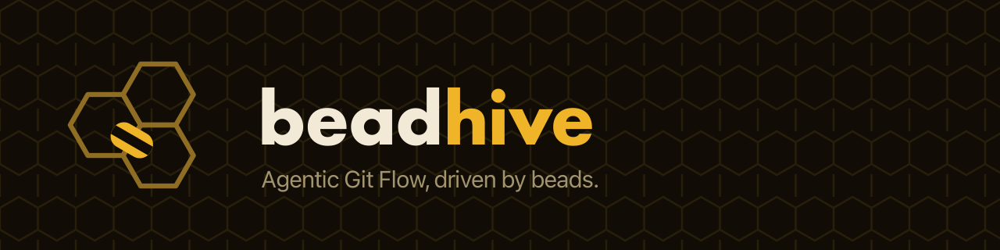

# Beadhive (`bh`)



`bh` is a single CLI for managing **beads** issue tracking across many repositories. Each
repo is its own beads database (a **hive**) with a short, stable prefix; `bh` onboards them,
keeps their labels consistent, runs `bd`/`git` across one or all of them, and aggregates
every hive into one cross-repo view — even hives whose code isn't checked out.

It's a thin orchestrator over `bd`, `git`, `git-workspace`, `dolt`, and `docker`: `bh`
encodes the conventions, the registry, validation, and routing. Config and runtime state live
under `~/.beadhive/`; **no issue data lives there** — each hive's issues live in its own Dolt
DB under `refs/dolt/data` on that repo's own git remote.

`bh` is the **Beadhive** umbrella's workspace CLI — the integration-plane driver for **AGF**
(Agentic Git Flow), the abstract, tracker-independent process. **Beadflow** is that process
implemented on beads: this repo's concrete implementation, unchanged behavior under a naming
layer. See [docs/AGF.md](docs/AGF.md) for the process and
[docs/design/limn-naming-strategy-adr.md](docs/design/limn-naming-strategy-adr.md) for the
naming decision record.

This repo is the CLI's source (Python package `beadhive` on PyPI, command `bh`).

## Install

**Agents:** point your agent at [`INSTALL.md`](INSTALL.md) — the preferred install path. It
carries a structured `install:` frontmatter block (the agent reads it, discloses the plan,
and asks before each command) plus a prose fallback any agent or human can follow.

**Manual** (pick one):

```sh
uv tool install 'beadhive[otel]'     # PyPI (recommended)
brew install beadhive/tap/beadhive   # Homebrew
```

Then scaffold the config home:

```sh
bh config init      # writes config.yaml + templates into ~/.beadhive/
```

**Optional (Claude Code):** the `bh` claude-plugin vends the AGF seat agent defs and role
skills; `bh mcp install` wires the MCP server at user scope:

```sh
claude plugin marketplace add beadhive/claude-plugin
claude plugin install bh@beadhive
bh mcp install
```

## Docs

New to bh? Start at [`**docs/ONBOARDING.md**`](docs/ONBOARDING.md) — the end-to-end guide
from fresh Mac to a configured AGF workspace with registered hives.

Everything else — the design and reasoning, configuration, the full command surface, and each
component — starts at [`**docs/OVERVIEW.md**`](docs/OVERVIEW.md).

## Develop

```sh
just bootstrap   # brew bundle + mise install + uv sync   (once per machine)
just install     # uv tool install --force '.[otel]' → ~/.local/bin/bh
just lint        # ruff check
just fmt         # ruff format
just test        # pytest
just build       # uv build
```
