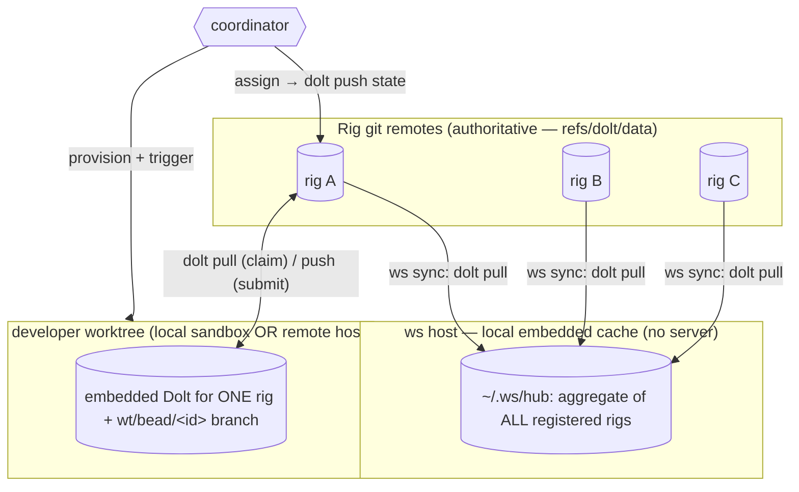

# Beads sync — distributing issue state to agents (design)

> Status: **design / intent.** It records how `ws` is meant to move beads issue state across
> the hub, each rig, and distributed agents using embedded Dolt and git-native refs — **no
> server required**. Parts are built (see *What exists vs gaps*); the role choreography is the
> target. The branch/worktree side of the same lifecycle is [WORK](WORK.md); the cross-rig
> read cache is [HUB](HUB.md); the optional shared server is [DOLT](DOLT.md).

## The bet: state travels on git refs, not a server

Beads stores issues in **Dolt**, which is versioned like git — commits and refs, pushed and
pulled between copies. Each rig's authoritative issue history lives on **its own git remote**
under `refs/dolt/data` ([OVERVIEW](OVERVIEW.md)). So moving issue state between machines is
just a Dolt push/pull of those refs — the **same transport** as the code branch handoff
(`wt/bead/<id>`). Two git-native channels move in parallel: the **branch** carries the change,
the **Dolt ref** carries the bead's state. No central database has to be online for an agent
to get its work or report progress.

This is why the [DOLT](DOLT.md) shared server is optional and, by default, unused: rigs are
embedded Dolt under each repo's `.beads/`, and distribution is git-native.

## Three vantage points

### 1. `ws` (hq) — a read cache over every rig

`ws sync` pulls each registered rig's `refs/dolt/data` into one **local embedded Dolt DB** at
`~/.ws/hub` (cloned rigs by path; uncloned by a blobless minimal-clone cache). `ws hq bd
ready` then answers "what's actionable anywhere?" across the whole workspace without a server
and without every repo checked out. This is built today — see [HUB](HUB.md). The HQ aggregate
is a **cache**: authoritative state stays on each rig's remote.

### 2. `developer` — one rig, one bead, anywhere

A developer agent (a local sandbox folder elsewhere on the box, or a wholly separate remote
host) does **not** need the hub or the central server. It pulls **its own copy of the one
rig's Dolt remote**, giving it that rig's issues, then works the assigned bead in its
worktree. On a remote host the worktree can't share a local object store, so the rig is
cloned and the `bead/<id>` branch + `refs/dolt/data` are the only things that cross — exactly
the handoff medium [WORK](WORK.md) and the `ws work` impl spec describe.

### 3. `coordinator` — assign here, run there

The coordinator owns the cross-boundary transfer:

1. **Assign + publish state.** `ws work assign <id> --to crew/<name>` stamps the assignee in
   beads, then **pushes that state to the rig's remote** (`bd dolt push`). The assignment is
   now durable on the ref, not just in the coordinator's local DB.
2. **Provision the worktree wherever** — local sandbox or remote host.
3. **Trigger the developer**, which **pulls the rig's Dolt remote** (sees the assignment) and
   `ws work claim`s the bead as its own actor (→ `in_progress`).

State crossed the boundary entirely through git refs: the coordinator never reaches into the
developer's machine to mutate a database — it pushes a ref, the developer pulls it.

## The choreography (assign → claim → submit → merge)

Every arrow to/from **R** is a Dolt push/pull of `refs/dolt/data` (state) or a git push/pull
of the `wt/bead/<id>` branch (code). Nothing requires a live server; an offline agent simply
syncs when it reconnects.

## Local vs remote developer

| | Local sandbox (same box) | Remote host |
|---|---|---|
| Code | linked `git worktree` (shared object store) or a clone | full clone of the rig |
| Bead state | shares the rig's embedded Dolt, or its own pull | own `bd dolt pull` of `refs/dolt/data` |
| Identity/signing | worktree-scoped git config ([WORK](WORK.md)) | same, but the signing key must be **injected**, not a local path |
| Handoff medium | branch + Dolt ref (object store may be shared) | branch + Dolt ref **only** |

The remote case is the strict superset: design for "only the branch and the ref cross" and the
local case falls out for free.

## What exists vs gaps

**Built today:**

- Embedded Dolt per rig under `.beads/`; authoritative history on each rig's git remote at
  `refs/dolt/data` (`bd dolt push` / `pull`).
- `ws sync` → the local hub cache aggregating every registered rig ([HUB](HUB.md)).
- `ws -a bd dolt pull` to refresh cloned rigs; minimal-clone bootstrap for uncloned ones.
- `ws work` lifecycle verbs over the local bead DB ([WORK](WORK.md)).

**Gaps (the net-new this design asks for):**

- **State push/pull wired into `ws work`.** `assign`/`submit` should `bd dolt push` the new
  state; `claim`/`resume` should `bd dolt pull` first, so a developer on another host actually
  sees the assignment. Today the verbs mutate only the local DB.
- **Per-rig developer bootstrap.** A one-shot "give this sandbox/host just rig X's beads" (the
  developer-side analogue of `ws sync`, scoped to one rig).
- **Remote triggering + key injection.** Launching the developer on a remote host and
  injecting its signing key (local key *paths* are meaningless there) — spec'd in
  the `ws work` impl spec, not built.
- **Conflict-free state merge.** When the coordinator and a developer both push bead state,
  Dolt merges the refs; the rules for the bead row (assignee/status) need to be pinned.

## Open questions

- Does the developer pull the **rig remote** directly, or a coordinator-curated ref? Direct is
  simpler and serverless; curated lets the coordinator gate what's visible.
- Where does the **hub** fit for a coordinator — is dispatch driven from the hub cache
  (cross-rig) then pushed per-rig, or always per-rig?
- One embedded Dolt per developer host shared across that host's worktrees, vs one per
  worktree — trade isolation against pull cost.

See also: [WORK](WORK.md) (lifecycle verbs), [HUB](HUB.md) (cross-rig cache),
[DOLT](DOLT.md) (optional server), [OVERVIEW](OVERVIEW.md) (the no-server model).
