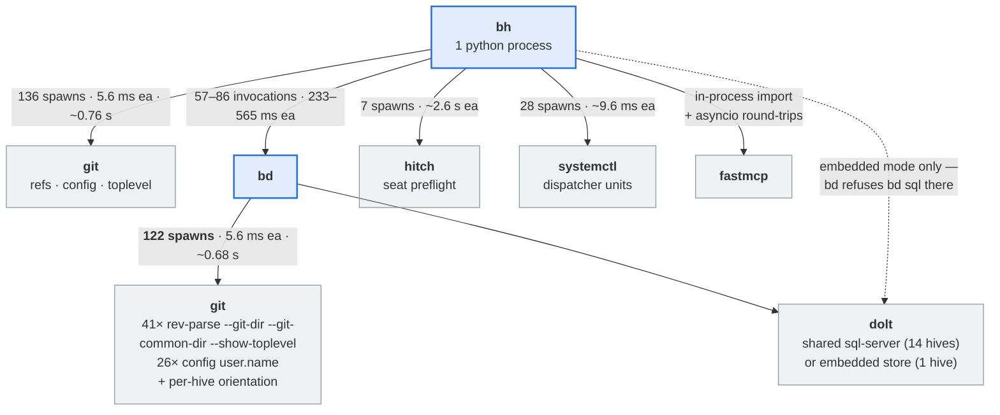
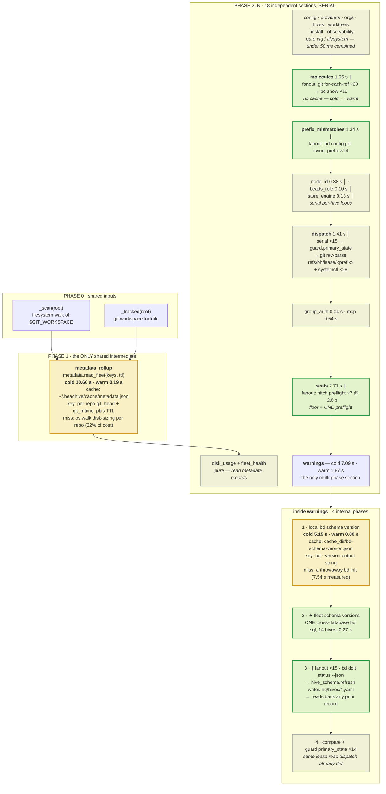

# The `bh` read-path data pipeline

A snapshot of **how `bh doctor` actually gets its data** — which processes it spawns, what
those processes spawn in turn, how the section layer is ordered, where the caches sit, and what
every piece of it costs cold and warm on a real host.

This is a **measurement record, not a design document**. It describes the implementation as it
stands at `b59750e`, so that later changes have something honest to be compared against. Nothing
here proposes work; the beads named throughout own that.

**Measured**: 2026-08-19, host `beadhive-factory` (Linux, load average 2.8–7.8 across the runs),
20 registered hives / 15 local `.beads/` stores, 14 of them server-mode on one shared Dolt
server and 1 embedded. `bh` run from source in the main clone.

**Toolchain under measurement**: `bd` as installed; `agent-hitch` at its `main` as of this date
(`679cfa9`), rebuilt and reinstalled partway through this snapshot. That upgrade moved
`hitch profile preflight` from ~1.8 s to **2.59 s** per seat and bh's `seats` section from
~2.55 s to ~2.7–2.9 s — a real regression for bh, recorded in §4.1 rather than smoothed over.
Every number below is against the NEW hitch unless it says otherwise.

**Method**: a shim placed ahead of the real binary on `$PATH` that logs each invocation's argv,
cwd, elapsed time and **parent process**, then `exec`s the real one. Section timings come from
`bh doctor -v` (`doctor._timed`, a monotonic stopwatch around each section builder).

---

## 1. Process layers

`bh` is one Python process. Everything else is a subprocess — and two of those spawn
subprocesses of their own, which is where nearly half the process count comes from.



Same thing in ASCII:

```text
  bh (python, 1 process)
   │
   ├─► git          136 spawns   5.6ms ea   ~0.76s   refs, config, toplevel
   │
   ├─► bd            57 warm / 86 cold invocations    ┐
   │    │                                             │ bd's OWN startup, before
   │    ├─► git     122 spawns   5.6ms ea   ~0.68s    │ answering anything:
   │    │            41x rev-parse --git-dir --git-common-dir --show-toplevel
   │    │            26x config user.name
   │    │            +   per-hive `-C <hive> rev-parse ...`
   │    │                                             │
   │    └─► dolt    shared sql-server, or embedded    ┘
   │
   ├─► dolt          direct — embedded-mode stores only (bd refuses `bd sql` there)
   ├─► hitch          7 spawns  ~2.6s ea              seats preflight
   ├─► systemctl     28 spawns  ~9.6ms ea             dispatch supervisor units
   └─► fastmcp       in-process import + asyncio      ~0.55s

  258 git spawns per run.  122 of them (47%) are bd's, not bh's.
```

**The load-bearing fact in this section**: every `bd` invocation forks `git` at least twice to
orient itself before answering anything. `bh` cannot remove those from the outside. They are
recorded on `bh-b5v4y` — "The read-path FLOOR" — as the first measured cause attached to that
bead's open question about bd's per-invocation startup cost.

---

## 2. The section pipeline

`doctor._collect` builds a dict literal. Python evaluates a dict literal in source order, so
**every section runs strictly one after another**. All parallelism in the read path lives
*inside* a single section, via `fleet.fanout` (shape B) or `fleet.sql` (shape A) — see
`src/beadhive/fleet.py` for the two shapes and the rule for choosing between them.



Same thing in ASCII:

```text
 legend   ║ = parallel inside the section (fleet.fanout)     │ = serial loop
          ● = cold/warm differs (cached)                     ○ = no cache
          ✦ = one cross-hive SQL query (fleet.sql, shape A)

 PHASE 0  shared inputs                                        cold    warm
 -----------------------------------------------------------------------------
   _scan(root)          filesystem walk of $GIT_WORKSPACE  o    0.01    0.01
   _tracked(root)       git-workspace lockfile read        o    0.01    0.01
        |
        +-------------> git_repos, nonrepo, unknown_top --------+
        |                                                       | feeds
 PHASE 1  metadata rollup   <- THE ONLY SHARED INTERMEDIATE     | 2 sections
 -----------------------------------------------------------------------------
   metadata.read_fleet(keys, ttl)                          *  10.66    0.19
        |   cache: ~/.beadhive/cache/metadata.json
        |   key:   per-repo (git_head + git_mtime) + TTL
        |   miss:  os.walk disk-sizing per repo  <- 62% of its cost
        |
        +-----> disk_usage   o  0.00   0.00   (pure, reads `records`)
        +-----> fleet_health o  0.00   0.00   (pure, reads `records`)

 PHASE 2..N  every remaining section, ONE AFTER ANOTHER
 -----------------------------------------------------------------------------
   config/providers/orgs/hives/worktrees  o  pure cfg      0.00    0.00
                                                          -------------------
   molecules       ||  fanout 1: git for-each-ref x20      1.02    1.06
                   ||  fanout 2: bd show x11
                   o   no cache - cold == warm
                                                          -------------------
   prefix_mism.    ||  fanout: bd config get issue_prefix  1.34    1.34
                   o   no cache
                                                          -------------------
   node_id         |   serial, early-exit: bd config get   0.40    0.38
   beads_role      |   serial x15: bd.beads_role -> git    0.11    0.10
   store_engine    |   serial x15: pure filesystem         0.13    0.13
                                                          -------------------
   dispatch        |   serial x15: guard.primary_state     1.38    1.41
                   |     +-> git rev-parse refs/bh/lease/<p>  <-- SAME READ
                   |     +-> systemctl x28                     as warnings
                                                          -------------------
   group_auth      o   git config --global (memoized)      0.04    0.04
   mcp             o   import fastmcp + asyncio            0.52    0.54
                                                          -------------------
   seats           ||  fanout: hitch preflight x7 @ 2.6s   2.70    2.71
                   o   no cache - floor is ONE preflight
                                                          -------------------
   install         o                                       0.04    0.04
   observability   o                                       0.00    0.00
                                                          -------------------
   warnings        -- the only multi-phase section          7.09    1.87
                   |
                   +- 1. local bd schema version       *   [5.15 / 0.00]
                   |     cache: cache_dir/bd-schema-version.json
                   |     key:   `bd --version` output string
                   |     miss:  a throwaway `bd init` (7.54s measured)
                   |
                   +- 2. * fleet schema versions - ONE bd sql,
                   |     14 hives cross-database, 0.27s
                   |
                   +- 3. || fanout x15: bd dolt status --json
                   |        +-> hive_schema.refresh -> writes hq/hives/*.yaml
                   |        +-> reads back any prior record
                   |
                   +- 4. |  compare + guard.primary_state x14  <-- DUPLICATE
                                                                   of dispatch
```

### What the shape says

**There is exactly one phase boundary.** `metadata.read_fleet` runs once and feeds `disk_usage`
and `fleet_health`. No other section consumes another's output — every one of the remaining 18
reads `cfg` and goes to the world itself. The serial ordering therefore buys nothing; it is
simply how a dict literal evaluates.

**Parallelism is one level deep and never crosses sections.** Four sections fan out internally
(`molecules`, `prefix_mismatches`, `warnings` phase 3, `seats`). The rest are serial per-hive
loops. Two adjacent ~1.4 s sections run back to back with idle cores between them.

**Only two things are actually cached**, and both are in the cold column: the metadata rollup and
the local bd schema version. Everything else costs the same on every run.

---

## 3. `bd` invocation patterns

`bh doctor` never calls `bd ready`. Not once. The verbs it does call, by exact shape:

### Warm run — 57 invocations, 21.85 s summed process time

| invocation shape | n | total | avg |
|---|---:|---:|---:|
| `-C <hive> config get issue_prefix --json` | 14 | 7.91 s | 565 ms |
| `-C <hive> dolt status --json` | 15 | 4.67 s | 311 ms |
| `-C <hive> show <bead> --json` | 10 | 4.49 s | 449 ms |
| `--version` | 15 | 3.49 s | 233 ms |
| `-C <hive> sql -q <union query> --json` | 1 | 0.47 s | 470 ms |
| `-C <hive> config get node_id --json` | 1 | 0.47 s | 466 ms |
| `-C <hive> dolt remote list --json` | 1 | 0.35 s | 350 ms |

### Cold run — 86 invocations, 37.91 s summed process time

| invocation shape | n | total | avg |
|---|---:|---:|---:|
| `-C <hive> dolt status --json` | **29** | 7.86 s | 271 ms |
| `-C <hive> config get issue_prefix --json` | 14 | 7.85 s | 561 ms |
| `init --prefix schemaprobe<hex> --non-interactive` | 1 | **7.54 s** | 7535 ms |
| `-C <hive> dolt remote list --json` | **15** | 5.46 s | 364 ms |
| `-C <hive> show <bead> --json` | 10 | 4.45 s | 445 ms |
| `--version` | 15 | 3.82 s | 255 ms |
| `-C <hive> sql -q <union query> --json` | 1 | 0.48 s | 476 ms |
| `-C <hive> config get node_id --json` | 1 | 0.46 s | 464 ms |

Summed process time exceeds the run's wall clock because the fanned-out sections run
concurrently.

### Three redundancies, and which are constant

**`bd --version` runs 15 times, warm and cold both, where the memo intends 1.**
`dolt_health._local_bd_version_string` is decorated with `functools.cache` precisely to stop
this — `bh-i6e5g` added it and took 12 spawns to 1 while the caller was a sequential loop. Then
`bh-ti7ws` made that loop concurrent, and **`functools.cache` has no stampede protection**.
Reproduced in isolation:

```text
@cache under a 15-way pool: underlying function ran 15 times (want 1)
@cache called sequentially : underlying function ran  1 times
```

All 15 pool threads miss simultaneously and all 15 fork `bd`. The memo's own docstring still
says "the second answer is the first one", which stopped being true the moment the caller went
concurrent. The wall-clock cost is modest because the forks overlap; the waste is 14 real `bd`
processes and a docstring that now makes a false claim. This is a **general hazard**: any
`functools.cache` reachable from `fleet.fanout` has it, and the fix is a lock, not a different
cache.

**`bd dolt status` doubles on the COLD path only** — 29 calls for 15 hives cold, 15 warm. The
extra pass comes in through the metadata rollup's miss path (`safety.scan` →
`_scan_bd_dolt_state`), not from the two doctor sections. `bd dolt remote list` behaves the same
way: 15 cold, 1 warm. Both are cold-path effects of the metadata cache missing, not a constant
duplication.

**`guard.primary_state` reads `refs/bh/lease/<prefix>` twice per hive, warm and cold** — once in
`dispatch` (`dispatch_status.compute_status_all`) and once in `warnings`
(`doctor._local_commits_while_not_primary`), both via `host_lease.read_cached`. 28 `git
rev-parse` spawns for 14 answers, ~0.08 s. Deduplicating it means caching a ref that has an
in-process writer (lease adoption), so it needs an invalidation contract across that write path
— measured and deliberately left alone; see `docs/design/read-path-source-measurement.md` §12.

### The cheapest handle on bd's startup cost

`bd --version` takes **233–255 ms**. It accepts no hive, resolves no cwd, opens no Dolt
connection, and prints a string. Whatever those milliseconds are spent on is **pure fixed
startup, isolated from any query** — which makes it the cheapest possible probe for `bh-b5v4y`'s
open question, rather than profiling a real query and subtracting.

---

## 4. Measured cold vs warm

Median of 3 interleaved rounds at `b59750e`. **Cold** deletes `metadata.json` and
`bd-schema-version.json` from `config.cache_dir()` before the run — the definition
`scripts/bench_read_path.py` already uses. It does **not** clear the OS page cache or Dolt
server buffers; neither is clearable without root, and doing so would make results
irreproducible across hosts. **Warm** is an immediate re-run with those caches populated.

| section | cold | warm | ratio |
|---|---:|---:|---:|
| `metadata_rollup` | 10.66 s | 0.19 s | **57.6×** |
| `warnings` | 7.09 s | 1.87 s | 3.8× |
| `seats` | 2.70 s | 2.71 s | 1.0× |
| `dispatch` | 1.38 s | 1.41 s | 1.0× |
| `prefix_mismatches` | 1.34 s | 1.34 s | 1.0× |
| `molecules` | 1.02 s | 1.06 s | 1.0× |
| `mcp` | 0.52 s | 0.54 s | 1.0× |
| `node_id` | 0.40 s | 0.38 s | 1.1× |
| `store_engine` | 0.13 s | 0.13 s | 1.0× |
| `beads_role` | 0.11 s | 0.10 s | 1.0× |
| `group_auth` | 0.04 s | 0.04 s | 1.0× |
| `tracked` | 0.01 s | 0.01 s | 1.0× |
| **TOTAL** | **25.21 s** | **9.85 s** | **2.6×** |

Sections below 5 ms (`config`, `providers`, `orgs`, `hives`, `scan`, `disk_usage`,
`fleet_health`, `worktrees`, `observability`, `install`) are omitted; together they are under
50 ms in either column.

### 4.1 The `agent-hitch` upgrade, isolated

`agent-hitch` was rebuilt from its `main` (`679cfa9`) partway through this snapshot, so the
`seats` numbers moved for a reason unrelated to any bh change. Measured directly rather than
inferred from the section total, since host load moved too:

| | old hitch | new hitch (`679cfa9`) |
|---|---:|---:|
| `hitch profile preflight <seat>` | ~1.80 s | **2.59 s** |
| bh `seats` section (7 seats, concurrent) | 2.50–2.55 s | 2.79–2.94 s |

**The upgrade cost bh roughly 0.35 s.** Where it goes, from an in-process profile of one
preflight: 72% is JSON-schema work — **34 schema loads of 5 distinct files**, of which
`hitch.schema.json` alone is read and re-`check_schema`'d **28 times for 1.17 s**. Across the 7
seats bh preflights, the pack layer shows the same shape: **38 pack loads for 14 distinct
packs**, a 2.7× redundancy.

Two things worth recording so they are not re-derived:

- Memoizing `_load_schema` by path is worth **−19%** per preflight (2.112 s → 1.716 s, median of
  3 interleaved fresh processes). An in-process measurement suggested −50%; that was warm-cache
  bias, and −19% is the honest figure.
- **Do not batch the preflights serially.** Seven preflights in one process take **9.79 s**
  against bh's current concurrent fan-out at **2.9 s wall** — a 3× regression. A batch verb only
  wins if it shares the pack resolution (14 loads instead of 38), not by avoiding process
  startup.

### bh-gqfrm (2026-08-19): Seats moved off the default `bh doctor` report, not cached

Re-dispatched scoped to ONE of the two routes the bead offered — the pack-tree-digest cache
(route 1) was ruled out at dispatch because `ah-jd4p` (agent-hitch's own projection cache, which
would make a bh-side cache of the same fact redundant) was confirmed still open, and this bead
was told to build only route 2 ("do not preflight every seat in a health report").

**The product question, answered explicitly.** `bh doctor`'s Seats section exists to answer
"which seats can this host run" — checking all 7 is real diagnostic value, and dropping it
silently would be a regression, not a win. But `bh doctor`'s *default* report already has a
graduated-detail precedent (`--verbose` for timings, `--json` for the full structured payload):
adding `--seats` to that list, so the default asks only "is hitch itself usable" (on PATH, repo
configured, catalog present — the same prerequisite checks `_readiness` always ran before ever
touching a seat) while the full per-seat breakdown is one flag away, keeps the fast path honest.
The default detail line says outright that per-seat checks were skipped and names the flag
(`hitch on PATH; repo …; per-seat checks skipped by default (pass --seats for per-seat
runnability)`) — a clean default report cannot be misread as "and all 7 seats passed". `bh doctor
--seats` and `doctor_payload(full_seats=True)` still run the complete 7-way fanout, unchanged
from before this bead (`hitch_plugin._readiness(cfg, entry, full=True)`, the default for that
function, which is also what `bh hive ready` still calls — that surface is out of this bead's
scope and keeps running the full check on every invocation).

A hitch or profile change is still caught the moment someone asks (`--seats`), and CI/dispatch
flows that need the full picture opt in explicitly rather than getting it by accident from a
warm cache going stale.

**Measured** (interleaved `git stash` / `git stash pop`, median of 3, this same host,
`bh doctor --json` end-to-end via `uv run` so the number includes uv's own startup):

| | before (all 7 seats every run) | after (`--seats` opt-in) |
|---|---:|---:|
| wall clock, `bh doctor --json` | 11.3–12.0 s | 7.1–7.5 s |
| `seats` section (internal timing) | 2.84–2.90 s | 0.2 ms |
| `total` (internal timing, excludes uv startup) | 9.90–10.60 s | 5.78–6.13 s |

The section cost drops to the prerequisite-check floor (sub-millisecond); the ~4 s wall-clock
delta is squarely the removed 7-way preflight fanout, not noise — every one of the 3 interleaved
pairs showed the same ~4 s gap despite host load moving between runs.

### Reading the table

**Cold and warm are two different programs.** Warm is 9.85 s, and its largest section is `seats`
(2.71 s) — already at its floor of one hitch preflight's latency (`bh-ls1ks`), which is why the
preflight regression above lands on bh in full. Cold is 25.21 s, and **17.75 s of it — 70% — is
two caches missing**: `metadata_rollup` (10.66 s) and the `bd init` scratch probe inside
`warnings` (7.54 s of that section's 7.09 s attributed cost, the rest overlapping in the pool).

**Every section with a ratio of 1.0× has no cache at all** and pays in full on every invocation.
`molecules` is the clearest example, which is exactly why optimizing it (`bh-7fen2`, 2.68 s →
0.96 s) showed up identically in both columns while a cache would only have helped the second
read.

**`bh doctor`'s warm number moved 11.95 s → 9.58 s** across the four beads landed 2026-08-19
(`bh-td8t9`, `bh-1qxjn`, `bh-7fen2`, `bh-0gvs3`) plus `bh-z31lc`, measured before the hitch
upgrade. It reads 9.85 s after that upgrade, under heavier load — the ~0.3 s difference is the
preflight regression in §4.1, not a bh change. Cold moved 26.83 s → 25.21 s over the same span
— a 6% change, because none of that work touched either cold-dominant cost.
The per-bead attribution is in `docs/design/read-path-source-measurement.md` §11–§12.

### What has no owner

`metadata_rollup`'s 10.80 s cold has **no bead**. It is the single largest cost in the pipeline
in either column when it fires, and it is bimodal in a way that hides it: 0.19 s warm means it
is invisible in any timing table taken during ordinary work, and every table collected while
this snapshot's work was done happened to catch it warm.

`bh-j68p3` closed the `bd init` scratch probe as "measured, unavoidable, call it less". That
verdict was reached when it was ~5 s of a 62 s run. It is now 7.54 s of a 24.72 s run — the same
cost against a denominator that shrank by more than half.

### bh-zzoek (2026-08-19): re-verdict against CURRENT bd and CURRENT code — still unavoidable

Re-checked bh-j68p3's own question list against `bd version 1.1.0 (dev)` and against `main`
post-`bh-gy7bc` (`_local_bd_version_string` is now `fleet.once`, not `functools.cache`), rather
than inheriting the 8%-era answer:

1. **What actually invalidates `cache_dir/bd-schema-version.json`? Confirmed: only a bd
   upgrade.** The cache key is `bd --version`'s exact string
   (`dolt_health.local_bd_schema_version`); nothing else touches it. Pinned by two existing
   tests (`test_local_bd_schema_version_caches_by_bd_version_string`,
   `test_local_bd_schema_version_reprobes_after_a_bd_upgrade`) and independently re-derived here
   by reading the code — `docs/design/read-path-source-measurement.md` §10 point 2 already
   established this; still true.
2. **Does `bh doctor` need the value at all, or only the sections that compare against it?
   Only the comparison — and that was a real, if currently inert, gap.**
   `doctor._bd_schema_skew_warnings` computed `local_bd_schema_version()` (the expensive probe)
   *before* checking whether any registered hive even has a local checkout to compare against.
   With zero such hives, the whole check returns `[]` regardless — meaning it paid the probe
   for nothing. Fixed (this bead): the entries filter now runs first, so a fleet with an HQ but
   no local checkouts pays nothing. **Does not change today's number** — this repo's own fleet
   has 20/20 registered hives with local checkouts, so the probe still fires on every cold run
   here; this is a correctness fix for the genuinely-empty case, not a measured win.
3. **Has bd's CLI gained a cheaper way since bh-j68p3? No — re-checked against 1.1.0's current
   surface, not assumed from the old answer.** `bd --help`'s full command list, `bd migrate
   --inspect [--json]`, `bd info [--schema]`, and `bd version --json` were all exercised fresh
   outside any repo: every one of them errors `no beads database found` or (for `bd
   version --json`) reports the hardcoded decoy `schema_version: 1` — none answer
   `LatestVersion()` for a bare binary. `bd schema` is unrelated (JSON Schema for bd's
   `--json`/export record shapes, not the Dolt migration version). No new surface exists.
4. **Is this worth an upstream ask on bd? Yes — filed as `bh-m8dki`**, not merely described:
   a `bd` verb reporting `LatestVersion()` without minting a repo is a one-line win for bd (it
   already computes the value to decide what to migrate to) that would let bh drop its most
   expensive cold-path step entirely.

**Re-measured cold, same definition (`metadata.json` + `bd-schema-version.json` deleted first),
this worktree's code via `uv run`, 2 clean runs**: cold totals 27.66 s / 25.70 s (`warnings`
section 7.00 s / 7.15 s — 25–28% of the run), consistent with the 25.21 s / 7.54 s (30%) figure
above within normal host-load noise; a third, non-representative cold run measured 46.9 s under
transient extra load and is excluded. The isolated `bd init --prefix schemaprobe<hex>
--non-interactive` call itself: 5.08 s / 5.08 s / 5.13 s over 3 runs — unchanged in kind from
bh-j68p3's 4.7–4.9 s (host-load variance, not a regression).

**Verdict: still unavoidable, on bd's CURRENT CLI surface, checked fresh rather than
inherited.** The ratio is real (~26–30% of a cold run, the largest or second-largest single
cost in the pipeline) but the cause is the shrunk denominator (§4's other cold wins), not this
line item growing or bd's surface regressing. The one real slack found — probing even when
there's nothing to compare against — is fixed. The remaining cost has no cheaper answer from
bh's side and is now tracked as a bd-side ask (`bh-m8dki`) rather than left as dead weight.

### `metadata_rollup`'s 10.66 s MISS attributed, then a verdict per angle (bh-f6w4d)

Same host as this doc's other numbers (`beadhive-factory`, 24 cores, load average 2.5–8 during
this session — lower than the 4–23 swing the bead's brief warned about, but still interleaved
per the protocol below). 21 on-disk repos under `$GIT_WORKSPACE` (`github/*` + `local/*`), the
same universe `doctor._collect` folds into `metadata.read_fleet`'s `keys` — smaller than the
20-hive/90-repo fleet §1 of `docs/METADATA-CACHE.md` profiled, so absolute per-repo numbers
differ; the attribution shape (which bucket dominates) is the finding, not the absolute ms.

**Attribution — where a single `metadata.measure()` call spends its time**, isolated with a
throwaway harness (`scripts/profile_metadata_rollup.py`, same neutralize-the-walk technique
`scripts/profile_fleet_health.py` used) over all 21 repos, real code path:

| bucket | per-repo | fleet (×21) | share |
|---|---:|---:|---:|
| `safety.scan`'s OTHER git calls (remote/rev-list/stash/worktree-list, ~7 spawns) | 291.0 ms | 6.11 s | **64.9%** |
| `_measure_disk_usage` `os.walk` (the one `docs/METADATA-CACHE.md` §1 names) | 128.8 ms | 2.71 s | 28.7% |
| `_maturity_commit_count` — a **second** `git rev-list --count HEAD`, duplicating a count `scan()` already computed internally and discarded | 7.7 ms | 0.16 s | 1.7% |
| `last_commit_age_days` (`git log -1`) | 7.4 ms | 0.16 s | 1.7% |
| `metadata._last_commit_date` (`git log -1`, a second format of the same commit) | 7.1 ms | 0.15 s | 1.6% |
| `fingerprint` (`git rev-parse HEAD` + one `.git` `stat`) | 6.4 ms | 0.14 s | 1.4% |
| **serialization** (`json.dumps` the whole cache + atomic `mkstemp`/`os.replace`) | — | 0.009 s | **0.09% of the total** |

**On THIS host/fleet, git-plumbing (5 of the 6 buckets, 71.3%) dominates the disk walk
(28.7%) — the inverse of §1's 90-repo profile (62% walk / 36% git, no cache in front of
either).** Two things explain the flip, not a contradiction: §1 profiled `safety.scan` alone
(no `fingerprint`/`_maturity_commit_count`/two commit-date git-log calls layered on top by
`measure()`), and this host's 21 repos are this repo's own working clones — none carries the
`node_modules`-sized trees (`untui`'s 5.5 s single-repo walk) that skewed §1's fleet toward the
walk. **Serialization was never a contender at any fleet size** — one `json.dumps` + one atomic
write for the whole batch, not per repo; §1 didn't measure it because it predates the cache
that does the writing.

**Verdict per angle, none skipped:**

1. **Is the walk the right question at all?** No universal answer — leave `measure()`'s payload
   as-is. `disk_bytes` is a genuinely-consumed field (`doctor._data_disk_usage`'s whole reason
   to exist, and `hive survey`'s disk column), and on this fleet it isn't even the dominant
   cost, so trading walk accuracy for a cheaper approximation would optimize the wrong bucket
   here. `docs/METADATA-CACHE.md` §4 already named the correct follow-up if the walk ever *is*
   the dominant bucket on some fleet (`du`, or `git count-objects` + skip gitignored trees) and
   scoped it as a `safety._measure_disk_usage` change — restated, not rediscovered, and left
   unbuilt: no fleet measured in this bead or `docs/METADATA-CACHE.md` §1 shows it as the
   blocking cost once git-plumbing is counted in full.
2. **Shape — is the miss path serial, and does parallelizing help?** Confirmed serial by
   reading the code: `refresh()` was a plain `for key in target: repos[key] = measure(...)`,
   the one large per-repo loop bh-1qxjn's shapes never reached. **Fixed this bead** — `refresh()`
   now runs through `fleet.fanout` (shape B: bounded per-repo fan-out, the correct shape per
   `fleet.py`'s own rule — this is a filesystem/git probe, not a bead-store read, so shape A
   never applied). Measured, not assumed: `metadata.refresh()` over the real fleet, 3 interleaved
   trials each — serial median **9.28 s**, `fleet.fanout` (workers=8) median **8.27 s**,
   workers=16 median **8.28 s** (no gain past 8 — the work saturates cores/spawn-rate before it
   saturates the pool cap). **State the two claims separately, per house standard:** the
   wall-clock win here is real but modest — ~11%, ~1 s on 21 repos — because ~65% of the cost is
   `git` subprocess spawns that themselves already release the GIL while `subprocess.run`
   blocks, so serial execution was never as serial as it looked; parallelizing buys the *walk*
   and *process-scheduling* overlap, not a clean N-way split. The fleet-size-scaling argument is
   separate and structural: cost was `O(n)` on the miss path and is now `O(n / min(8, n))` —
   larger fleets (§1's 90-repo case) gain more in absolute terms than this 21-repo one did,
   independent of today's noise.
3. **Cold is not rare for everyone.** Restated, not re-argued — §1 and this section both measure
   the FIRST-run cost directly (deleting `metadata.json` before every "cold" row), which is
   exactly what a fresh host/CI/container pays once. No angle-specific action beyond the shape
   fix above: a fresh host still pays a full fleet walk on its first `bh doctor`, just ~11%
   faster after this bead.
4. **`on_miss='stale'` for doctor — a product decision, argued, verdict is LEAVE IT (don't
   flip the default).** `read_fleet(..., on_miss="stale")` serves a stale entry as indistinguishable
   from a fresh one (same `RepoMetadata` shape, no "this is old" marker in the payload) and
   serves a genuinely-*missing* entry as **absent** — for a truly cold cache (angle 3's fresh
   host/CI/container case) that means EVERY entry is missing, so `doctor`'s Disk Usage and Fleet
   Health sections would render as empty on exactly the run where a new user or a CI pipeline
   forms its first impression, with no indication anything was skipped. `docs/METADATA-CACHE.md`
   §5 already made the identical argument against a per-section timeout ("partial fleet totals
   … worse than an honest 'refreshing' marker") and it applies unchanged here: a diagnostic
   silently under-reporting is worse than a diagnostic that is slow. §5's own proposed follow-up
   — a `cache: last refreshed <ago>, N stale (refreshing)` status line, gating any product
   decision to serve stale data on that line existing — is still unbuilt and is the actual
   prerequisite, not this bead's scope. `worktree.py`'s one `read_fleet(..., ttl=0)` call and
   `survey.py`'s `read_fleet(cfg, keys, ttl=metadata.ttl(cfg))` (default `on_miss="compute"`,
   unchanged) were re-checked; neither passes `on_miss="stale"` either, so today's default is
   consistent across every caller, not just `doctor`'s.

**Relationship to `bh-5sizy` / `bh-b5v4y`, stated directly:** `bh-5sizy` (read-path cache
pipeline) would generalize this cache into a "source" under a shared layer contract — orthogonal
to this bead, which only touches the MISS cost, unaffected by any layer contract sitting on top
of an already-working 57.6× cache. `bh-b5v4y` (the read-path floor) is about `bd`/`git`
per-invocation startup cost that `bh` cannot remove from outside those binaries; this bead's
git-plumbing bucket (71.3% of `measure()`, five buckets of ~8 spawns/repo) is a *different*
instance of the same floor shape — irreducible per-spawn cost, not a cache concern — but it is
inside `bh`'s own call graph (`safety.scan` decides how many spawns per repo), unlike
`bd`'s/`hitch`'s own startup which bh cannot touch at all. Recorded here as a second data point
for `bh-b5v4y`'s open question, not folded into it.

**Freshness contract — unchanged, verified by the test suite.** The shape fix only changes HOW
`refresh()`'s per-key loop executes (serial → `fleet.fanout`), not what it computes, stores, or
invalidates: `is_stale`'s `(git_head, git_mtime)` fingerprint comparison, `store()`'s atomic
write, and `invalidate`/`invalidate_all` are untouched. `tests/test_metadata.py`'s full 37-case
suite (HIT / MISS / STALENESS triangle, TTL semantics, `on_miss="stale"` behavior, cold-start
tolerance) passes unmodified against the new `refresh()` — the `monkeypatch.setattr(metadata,
"measure", fake_measure)` stub tests rely on still work because `fleet.fanout`'s worker calls
`measure(...)` as a late-bound module global, same as the loop it replaced.

**Re-measured, cold AND warm, same host, same protocol as §4's table above (median of 3
interleaved before/after rounds, `git stash` toggling this bead's change, `metadata.json` +
`bd-schema-version.json` deleted before every cold row):**

| | cold (median) | warm (median) |
|---|---:|---:|
| `metadata_rollup`, before (main, serial `refresh`) | 10.85 s | 0.19 s |
| `metadata_rollup`, after (this bead, `fleet.fanout`) | **10.43 s** | 0.19 s |

**Warm is unchanged, as expected** — a warm run's entries are all fresh, so `read_fleet` never
reaches `refresh()` at all; the shape fix only fires on a miss. **Cold drops ~0.42 s (~3.8%)**.

CORRECTED ON REVIEW, and worth stating plainly because this document's whole value is that its
numbers can be trusted. This bead first reported the section delta as ~1.0 s (~9.5%), read
across from the isolated `refresh()` measurement (9.28 s → 8.27 s). Re-measured by the reviewer
over **ten interleaved cold pairs using two independent methods** — two separate checkouts, and
this bead's own `metadata.py`-toggle inside one worktree — both land on **~0.42 s (~3.8%)**:

```text
two checkouts (6 pairs)   before median 10.79 s   after median 10.37 s
file toggle   (4 pairs)   before median 10.85 s   after median 10.43 s
```

The isolated `refresh()` figure is not wrong; **it just is not the section's figure**.
`metadata_rollup` times `read_fleet`, which is `load()` + `_fleet_keys()` + a per-repo
`is_stale()` pass + `refresh()` + `store()`. Only `refresh()` was parallelized, so the rest of
that work dilutes the win. Reading an isolated function's delta across to the section that
contains it is the specific error corrected here.

**This does not change the section's bimodality or its unowned-ness verdict** — it
is still ~50× more expensive cold than warm, and still the largest cold-column cost in the
pipeline; this bead's fix trims that cost by under a twenty-fourth, it does not remove
the bimodality
(the walk + git-plumbing per repo is still paid in full on every miss, per angle 1's verdict).
