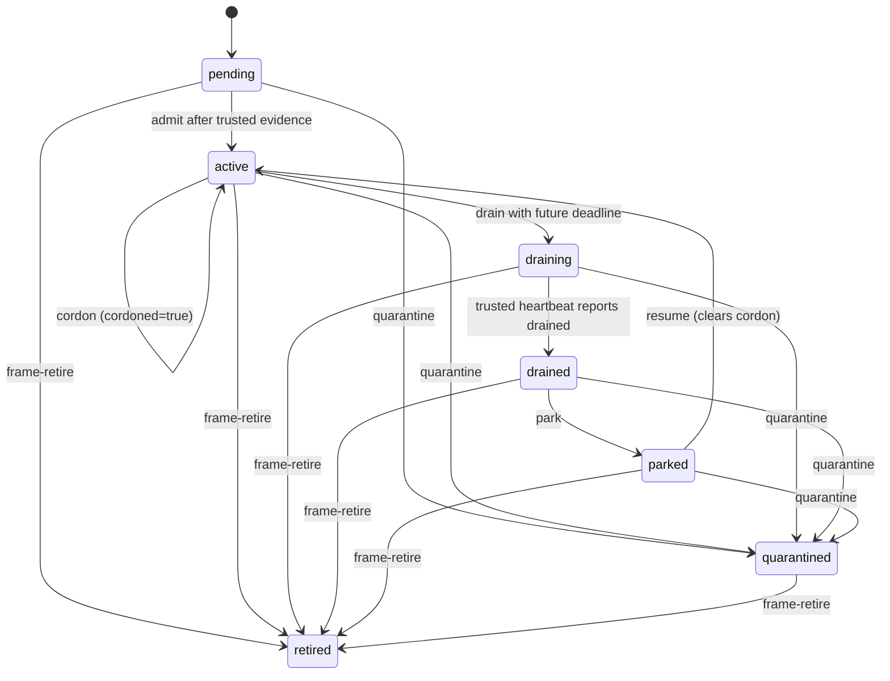

# Frame fleet membership and HQ configuration

This guide describes the Beadhive frame membership surface and the selected HQ
configuration backend. It covers operator actions and readiness boundaries; it
does not record a production cutover. See the [Frame platform contract](https://github.com/beadhive/frame/blob/main/docs/design/frame-platform.md)
for the upstream contract. The local [heartbeat design](design/signed-host-heartbeats.md),
[eligibility design](design/frame-eligibility.md), and [config cutover runbook](design/dolt-hq-config-migration-runbook.md)
describe implementation details.

## Choose the HQ configuration mode

`hq.mode` selects the fleet configuration source. It does not select the Beads
database, enroll a frame, or admit work. `git` is the explicit compatibility
mode; `dolt-server` reads a committed shared SQL configuration snapshot. A
configured SQL failure is unavailable and fails closed. It never falls back to
Git. The Git HQ repository may still carry HQ-origin Beads records and serve as
the signed config source for fleets that select Git.

The home configuration file is host-local. A SQL reader binding belongs there
as non-secret endpoint, TLS and broker-reference metadata. Do not put a
password, private key or credential payload in YAML:

```yaml
hq:
  mode: dolt-server
  beadyard_id: "<canonical-uuid4-from-beadyard.json>"
  authority_anchor: /var/lib/beadhive/hq/operator-anchor.json
  admission_policy: manual
  sql:
    enabled: true
    reader:
      host: config.example.invalid
      port: 3308
      database: beadhive_config
      user: bh_config_reader
      tls_mode: required
      server_name: config.example.invalid
      ca_file: /etc/beadhive/config-ca.pem
      credential:
        config_path: /etc/beadhive/broker.yaml
        profile: beadhive
        key: hq.sql.reader.password
    floor_path: /var/lib/beadhive/hq-config-floor.json
    backend_identity: "<operator-provisioned-backend-id>"
    generation: "<operator-provisioned-generation>"
    initial_revision: "<32-character-dolt-revision>"
```

This is a shape example, not a deployable endpoint. With the default
`tls_mode: required`, the reader needs native MySQL TLS, CA verification, matching
`server_name`, broker access and the pinned backend/generation/revision floor.
`hq.sql.enabled: false` prepares a binding
without selecting SQL. Configure `hq.sql.publisher` only for the trusted
publisher; runtime, observer and authority-writer principals use their own
separate bindings and grants. The publisher can stage and commit a Dolt branch;
it is not a runtime credential.

The authoritative CLI view is `bh config schema --json`. The generated package
JSON Schema is
[`config-v1.schema.json`](../src/beadhive/schemas/contracts/v2.0.0/artifacts/config-v1.schema.json).
Inspect the installed CLI contract before preparing HOST configuration:

```sh
bh config schema --json
```

These are distinct from the language-neutral `docs/schemas/wire` snapshots.
YAML settings remain schema version 1; fresh config storage uses metadata v3;
the signed Git config carrier is `beadhive/fleet-config/v2` with a v1
compatibility reader; signed heartbeat envelopes use
`beadhive/frame-heartbeat/v2` and the Frame API schema
`frame.beadhive.ai/v1alpha2`. Identity-bound heartbeats use the v2 domain; v1 remains a legacy
compatibility domain for unbound records. None of these is a Beads database migration or a
wire-v3 release.

The one HQ identity is the UUID4 `beadyard_id` field in `beadyard.json`.
Create it once during explicit new-HQ setup; ordinary reads never generate it.
The HOST-local `hq.beadyard_id` is a pin to that identity. A frame also needs its own SSH key:
register the public key with the source forge for both repository authentication and commit
signing, and with the trusted `allowed_signers` policy for signature verification. Keep the
private key on the frame. These
frame credentials and ordinary source-repository access are separate from the HOST's SQL reader,
observer, runtime or authority-writer credentials and broker references. Inspect authority
with `bh hq beadyard --json`; its `legacy`, `pending` and `incomplete` results
identify distinct recovery states. A legacy HQ uses the reviewed explicit
adoption flow against its original revision (Git example:
`bh hq beadyard-adopt --expected-revision <original> --confirm`, plus
`--operator-key <approved-key>` for protected Git). Never mint a replacement
ID to resolve a conflict. See [HQ identity and adoption](HQ.md#canonical-hq-instance-identity).

For Git legacy adoption, bind operator-approved authority explicitly after the
matching identity publication:

```sh
bh hq authority bind-beadyard --expected-revision <authority-revision> \
  --operator-key <approved-operator-key> --confirm
```

The same frame signer must then publish fresh identity-bound registration and
heartbeats. On a protected Git server, the identity-only config advance also
fences the prior hive-policy projection. Run the explicit
`bh hq beadyard-policy-refresh` procedure in [HQ identity and adoption](HQ.md#canonical-hq-instance-identity)
with the original config parent/head, policy digest and complete operator/frame
anchor set. This operator custody step is Git-server-specific. Ordinary reads
never refresh policy trust, and neither command enrolls or admits a frame.

For a new dedicated SQL configuration store, use the value-free plan and
reviewed seed procedure in the [migration runbook](design/dolt-hq-config-migration-runbook.md).
The operator command is `bh hq migrate --to dolt-server` for the plan, then
`bh hq migrate --to dolt-server --confirm --intent <private-journal>` for the
reviewed apply. Use the same protected journal and original inputs if recovering
an ambiguous result. The command is a config-only selector transition; it does
not migrate the Beads database or its remote.
The plan binds the current Git HEAD/status, selected workspace input order and
bytes, HOST-owned values, identity and destination schema parent. Dirty or
changed inputs, conflicts, an unexpected document or a nonempty/dirty
destination require a new plan. The source plan is rechecked at apply time; a
saved hash capture is not authority. Keep HOST identity, private credentials,
workspace root, per-host runtime values, Beads binding and lease state local.

Each frame-managed hive can declare a fleet-owned admission policy under
`managed_repos[].frame_policy`. For example:

```yaml
managed_repos:
  - provider: github
    org: acme
    repo: api
    prefix: acme-api
    frame_policy:
      config_revision: "fleet-policy-2026-10-03"
      requires:
        harnesses: [codex]
        isolation: vm
        max_sessions: 2
      evict_after_s: 900
```

`requires` accepts `isolation`, `trust_zone`, `arch`, `harness`, `harnesses`
and positive `max_sessions`. A committed config change must receive a matching
protected policy projection before frame intake resumes. Omitting
`frame_policy` denies frame intake for that hive; the ordinary config publisher
does not enroll or admit a frame.

A frame's declared `capabilities.isolation` is one of `kvm`, `microvm`, `container` or
`workstation`. A host document may also carry the optional `execution_hives` list of hive
prefixes the frame may execute; omit it for no restriction. Authoring routes are separate. Both
are accepted by the host-document schema so documents written by the plan-c build still load.

## Config and Beads readiness are separate

Use these names for different checks:

| State | Meaning |
|---|---|
| `CONFIG_READY` | The selected backend returned the expected committed config revision and canonical HQ identity. |
| `BEADS_READY` | The selected Beads engine reports an existing usable store or a supported recoverable origin, and bootstrap/readback succeeds. |
| `AUTHORITY_READY` | Current signed runtime authority and policy projection verify, and the frame's liveness evidence is present: **session and evidence rows** on a data-switched `dolt-server` frame (0.23.0), otherwise the trusted observer's receipts (0.22.x signed or receiver mode, and `git` HQ). |
| `ADMITTED` | An operator has admitted this declared frame under the current protected authority. |
| `ELIGIBLE` | All current frame, heartbeat, release, capability, hive-policy and dispatch predicates pass for the requested hive. |

`bh host provision --dry-run` reports engine/origin readiness; provisioning
reuses a supported store or hydrates it from a published origin. It does not
reinitialize an existing Beads database. A host can be `CONFIG_READY` while
`BEADS_READY` or `AUTHORITY_READY` is false. Neither config selection nor
successful hydration admits a frame. SQL outage or a changed authority revision
denies new intake instead of using Git or stale cached authority.

## Frame lifecycle and eligibility

Protected desired lifecycle states are `pending`, `active`, `draining`,
`drained`, `parked`, `quarantined`, and `retired`. `cordoned` is a separate
protected flag. The operator controls admission and lifecycle transitions;
the frame reports observations but cannot grant itself admission.



The CLI uses plan/apply/check with an expected protected revision. For example,
plan an admission without writing, then apply only the reviewed revision and
identity:

```sh
bh host admit plan frame-builder-01
bh host admit apply frame-builder-01 \
  --expected-revision <authority-revision> \
  --expected-host-id <host-incarnation> \
  --expected-release <release-id> \
  --operator-key <approved-operator-key> --confirm
bh host admit check frame-builder-01
```

`admit` accepts a pending candidate only after current trusted registration and
at least three consecutive fresh accepted heartbeats; a second active
incarnation needs explicit `--supersede`. The other lifecycle verbs are:

| Verb | Effect and example plan |
|---|---|
| `cordon` | Stop new intake for an active frame: `bh host cordon plan frame-builder-01`. |
| `drain` | Request a bounded drain with a future Unix deadline: `bh host drain plan frame-builder-01 --deadline <unix-seconds>`. |
| `park` | Park a drained frame: `bh host park plan frame-builder-01`. |
| `resume` | Resume a parked frame and clear its cordon: `bh host resume plan frame-builder-01`. |
| `quarantine` | Deny intake pending operator recovery: `bh host quarantine plan frame-builder-01`. |
| `frame-retire` | Retire the declared frame/incarnation: `bh host frame-retire plan frame-builder-01`. |

Apply a reviewed plan with that verb's `apply` action, `--expected-revision`,
`--expected-host-id`, `--expected-release`, `--operator-key` when required,
and `--confirm`; use `check` to read back protected state. `drain apply` also
requires `--deadline`. `frame-retire` is frame lifecycle retirement; `bh host
retire` is the separate host-local decommission workflow.

An observation is not an admission. The sender publishes a signed bounded
heartbeat, for example `bh host heartbeat /run/beadhive/heartbeat.json`. Its
record binds frame ID, canonical HQ ID (v2), host incarnation, substrate
instance, key fingerprint, frame epoch, audience, config revision, monotonic
sequence, sender time, interval/TTL, release, state, conformance, capacity and
report digest. The trusted observer supplies current authority and durable
first-seen/replay receipts; sender-provided timestamps cannot make an old beat
fresh. TTL is exclusive (`age < leaseDurationSeconds`), capped at 900 seconds
and at least three report intervals. A repeated signed record does not renew
freshness.

### Session and evidence rows (0.23.0, `dolt-server` HQ)

On `dolt-server` HQ the signed beat is replaced, per frame incarnation, by two operator-provisioned
single-row tables, `frame_<principal>_<epoch>_session` and `_evidence`
([HQ](HQ.md#session-rows), ADR §5, `src/beadhive/hq_sql_session.py`). The HQ server stamps both
times (`UTC_TIMESTAMP(6)`), so a frame's clock cannot make a stale frame look fresh and there is
no observer receipt to wait for.

- **Renewal** is its own loop, separate from conformance: one `UPDATE` per tick of the session
  row (`python -m beadhive.heartbeat_sender renew`, unit `beadhive-session-renew`, 60 s). The
  conformance job writes the evidence row on its own timer (default 300 s).
- **Expiry** is computed by the reader from the operator's `hq_liveness_policy`:
  `session_ttl_s` (default 300) for the session, `evidence_ttl_s` (default 900) added to the
  evidence's `measured_at`.
- **Data is the switch.** The reader uses these rows exactly when both tables exist for the
  incarnation, with no config key; otherwise it reads the signed inbox. During the Φ3 soak the
  sender dual-writes both.
- **`BH_FRAME_HEARTBEAT` is ignored** on a switched frame (logged as
  `ignored: session liveness`): a stale session is not waivable.
- **Claim-time stamps.** A claim records the admitted session `renewed_at`, evidence
  `measured_at` and evidence digest, replacing the receiver's per-beat audit.
- **Account hardening** is mandatory: frame accounts are `'<principal>'@'<frame address>'`,
  `REQUIRE SSL`, and no hive database is co-hosted on the HQ server.
- `git` HQ keeps the signed `HeartbeatLease`. Execution frames are scoped to `dolt-server` HQ.

**Release ranges (`bh-vfrem`) are not part of 0.23.0.** A frame grant still pins one release;
`release_matches` compares against it exactly. When release ranges land, `release_matches` and
`conformance_pass` become range-aware over the evidence row; until then a release change is a
reviewed grant rotation (`bh host release-upgrade`). The version ranges that do exist in 0.23.0
belong to the test canary, not to grants
([CONFIGURATION](CONFIGURATION.md#fence-canary-ranges)).

Inspect a candidate and a hive's policy with:

```sh
bh host eligible frame-builder-01 --hive github/acme/api
```

Eligibility requires available current authority; declared active and
uncordoned lifecycle; exact frame/host/instance/HQ identity binding; a verified
fresh non-candidate heartbeat; matching release and capabilities; conformant
checks; compatible hive requirements; executor (not viewer) role; positive
session capacity; and enabled dispatch. A false predicate denies intake.
`bh host eligible` explains predicates; it does not admit the frame. Claims
recheck eligibility at the write boundary. See the
[eligibility contract](design/frame-eligibility.md) for the complete predicate
and lease rules.

`cordon` and `drain` stop new intake. Drain does not erase or steal an
incumbent hive lease: ordinary renewal/release remains bound to the current
authority, original compare-and-swap and expiry policy. Preserve the same host,
frame, actor, key, branches and leases across config cutover; do not reset or
re-enroll an incumbent as a migration shortcut.

## Add another machine

Git compatibility mode uses the Git HQ remote and its explicit clone path.
Central SQL mode attaches from HOST-local trust metadata and broker references;
it does not require an HQ checkout or HQ GitHub credential. Both modes still
need ordinary source-repository provider access. Use `bh host provision
--dry-run` to inspect readiness before applying. A real SQL selection requires
the reviewed seed/readback and guarded HOST selector switch in the
[cutover runbook](design/dolt-hq-config-migration-runbook.md); this guide does
not assert that deployment occurred.

The homelab walkthrough is one historical reference design, not a platform
requirement or deployment proof. Until a published release contains these APIs, install only an
approved exact Fleet source revision with its matching managed-check closure receipts; do not use
floating `latest` or assume version `0.20.2` contains them. The receipts qualify source checks,
not a built artifact. The final deployment handoff must name the exact artifact hash and Nix store
closure for that source revision. The homelab reference is: [homelab revision-5 provisioning example](https://github.com/briancripe/homelab/blob/main/docs/wip-bead-frame-provisioning-design.md),
linked from the [Frame platform design](https://github.com/beadhive/frame/blob/main/docs/design/frame-platform.md).

## Switch back to Git after SQL edits

Do not switch by setting `hq.sql.enabled: false` or pointing at the old checkout.
Freeze central config publishers, prove the bounded writer-suspension evidence,
export and sign the latest SQL config and the same `beadyard_id`, verify parity
and lineage, install/read back the Git mirror, then use the guarded HOST selector
procedure. Keep SQL history and the original private journals. The exact
commands and recovery behavior are in the
[latest-authority rollback procedure](design/dolt-hq-config-migration-runbook.md#latest-authority-return-to-git).

After verified live cutover, the old Git checkout can be described as a
historical config snapshot and automatic config publication must have stopped.
That does not retire HQ: HQ-origin beads, intake/escalations, signer custody,
backups, replication, credentials and remote recovery each need an independent
durable path and successful restore. See the
[deprecation readiness assessment](design/hq-config-deprecation-readiness.md).

## Source and acceptance evidence

The [Dolt-first cutover ADR](design/dolt-first-hq-config-cutover-adr.md) records
the decision boundary. The [current seed inventory](design/dolt-hq-current-seed-inventory.md)
and [redacted seed evidence](design/dolt-hq-seed-evidence.md) identify source
ownership without publishing config values. The [composed membership E2E record](design/fleet-membership-e2e-evidence.md)
and [readiness assessment](design/hq-config-deprecation-readiness.md) report
isolated source-backed proof and its limits. These records do not establish a
live central endpoint, production HOST selector, stopped writer, deployment,
Beads migration or HQ retirement.
