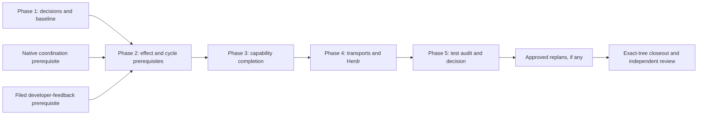

# Repository organization design and implementation-plan review

Review date: 2026-09-23 UTC. Repository and live-bead evidence read during this review,
ending approximately 03:00 UTC. This is advisory review feedback, not a lifecycle approval.

## Executive summary

**Keep the capability-first design, but amend the implementation plan before treating it as
a complete route to the ADR's repository-wide finish conditions.** The architecture is
coherent: capability ownership, inward ports, narrowly shared mechanisms, product-specific
integrations, explicit composition, and executable compatibility are appropriate for this
repository. The principal weaknesses are incomplete allocation of remaining implementation,
gaps between architectural rules and executable enforcement, and unassigned build/test
topology work.

Luna's handoff was accurate about the distinction between architecture and physical cleanup,
but its phase-one evidence is now incomplete. **Phase one is live-verified as closed and
merged into the workstream container, not into `main`.** The container includes the root
guard, successor repair, documentation reconciliation, and historical-proof checker repair.
Reviewing only `226746b` would miss those changes. The “proposed” heading has been corrected
on that container; its illustrative layout still needs reconciliation.

The most consequential findings are:

1. An inventory of 202 legacy root implementations names three epics collectively, without
   assigning each family a destination and delivery leaf. The filed leaves do not demonstrate
   coverage sufficient to reach zero root implementation debt.
2. Local adapters and package API entry modules are classified as legacy by the import
   checker. Explicit public exports, frozen root allowances, and the full facade lifecycle
   are not enforced as the new ADR describes.
3. The ADR requires independently addressable capability-role targets and checked closure
   mappings, but no implementation leaf explicitly builds that mapping/checker foundation.
4. Cycle successors do not match the actual removal phases, and the phase-two final
   validation task omits one implementation prerequisite.

These are reasons to repair the plan and its prerequisites, not reasons to reverse the
architecture. The test-audit phase has a sound authorization boundary: collect evidence,
make a decision, then replan any approved changes. Preserve that boundary.

## 1. Verified state and evidence provenance

### Git and integration state

| Surface | Verified revision or state |
| --- | --- |
| Checked-out `main` | `40f3b23a5d1b0afb07f27e263193d7a9f0d549bf` |
| `main` tree | `c83ec3c6ffbbab77607e9e38f6db24c01b0e19e9` |
| Local `origin/main` tracking ref | Same commit as `main`; no remote fetch performed |
| Workstream `wt/bead/epic/bh-cgfj0` | `cd80d16f80a1ea630c3186ed58f7dbc71c586827` |
| Workstream tree | `5256895f8d50ef6df944f30e05dd27784ad52345` |
| Phase-one batch `wt/batch/bh-50gsn` | `a2e8d543f0d874ae282ee1d26ad85fb4a110dece` |
| Shared baseline / merge base | `a8399581980d1287e05f33931525c25a5bb10bbc` |
| Handoff ADR commit | `226746b6da0b8dddd8c2bc6b51ac49e26e5a9d2d` |
| Main checkout on entry | Dirty only at `docs/design/jev-as-composition-candidate-map.md` |
| Workstream checkout | Clean at `/tmp/bh-worktrees/github/beadhive/beadhive/bh-cgfj0` |

Both `226746b` and `a2e8d543` are ancestors of `cd80d16f`; neither phase one's
completed container result nor the handoff ADR commit is an ancestor of `main`.
The workstream merge commit is titled `chore(merge): molecule bh-50gsn`.
`main...wt/bead/epic/bh-cgfj0` has **16 main-only and 14 workstream-only commits**.
No other branch/worktree tip for the requested later phases was present in the local ref
inventory. These facts support staged integration, rather than a discrepancy between the
closed phase-one bead and its container landing.

The existing dirty document was not edited by this review. Its working-copy content is not
used to establish committed architecture policy.

### Live bead status

The first sandboxed read failed because local sockets and the shared workspace lock were
unavailable. An approved read outside that sandbox succeeded. Status and dependency analysis
below uses **live** `bh work issue` and `bh work list --all --limit 0 --include-gates --json`,
not the local JSONL export. Gate records matter: the default list hides them.

| Bead and title | Live status | Relevant dependency / integration observation |
| --- | --- | --- |
| `bh-cgfj0` — Workstream: finish repository organization, validate tests, and codify testable Python | In progress | Kickoff approved; workstream container exists |
| `bh-50gsn` — Decide repository physical cleanliness and refresh the exact-tip architecture baseline | Closed | Close reason `molecule landed`; landed into `bh-cgfj0` |
| `bh-31p2s` — Cut legacy effect cycles and establish adapter prerequisites for physical consolidation | Open | Blocked by closed phase one and two open external prerequisites described below |
| `bh-7oo93` — Complete capability packages and shrink legacy compatibility facades | Open | Blocked by `bh-31p2s`; 27 substantive leaves open |
| `bh-ym56t` — Finish transport, daemon, bootstrap, and Herdr integration consolidation | Open | Blocked by `bh-7oo93`; 19 substantive leaves open |
| `bh-4kmy0` — SPIKE: audit post-refactor tests for relevance, duplication, vacuity, and ownership | Open | Blocked by `bh-ym56t`; six substantive leaves open |
| `bh-cgfj0.1` — Assemble the repository-cleanliness workstream closeout and operator review packet | Open | Blocked by `bh-4kmy0`; workstream kickoff gate is closed |

Phase one's six substantive children are all closed: baseline (`.1`), physical ADR (`.2`),
successor repair (`.3`), root guard (`.4`), documentation reconciliation (`.5`), and pinned
historical-checker repair (`.8`). Review and kickoff state-change records are not additional
implementation tasks. All directly attached kickoff gates for the requested phases are
closed, and later epic labels say kickoff approved. Approval to start does not remove their
dependency blockers.

Two open external prerequisites currently block phase two:

- `bh-yml5h` — guarded native coordination: v1.3 claim arbitration, CAS guards, heartbeat
  supervision, and replica-local reclaim. It in turn depends on open `bh-ywew7` — smaller
  bounded bead reads. This is a justified behavior prerequisite for moving work/engine code.
- `bh-ecmmo.1` — rerun prior failures after a fix as developer-only feedback. Its blockers
  include an open human gate and `bh-068zo` — emit JUnit XML into `BH_TEST_REPORT_DIR`.
  This is an explicit current ordering decision; it must not be mistaken for permission to
  replace full correctness gates with a passing subset.

The reachable `blocks` graph for the selected records and prerequisites is acyclic:
131 nodes and 120 edges, including gate/event records; no missing referenced records.
Parent-child relations were analyzed separately from scheduling edges.

### Refreshed measurements

Counts below come from tracked Git paths and TOML at the named commits. Import/SCC results
were also recomputed with the native AST collector on the current main and clean workstream
checkouts. Python totals include package markers; root implementation/facade totals exclude
the package-root `__init__.py`. Test totals count Python files, not collected test cases.

| Measure | Sept. 21 baseline `a839958` | Current main `40f3b23` | Phase-one container `cd80d16f` |
| --- | ---: | ---: | ---: |
| Production Python files | 337 | 337 | 337 |
| Root implementation / compatibility files | 212 | 212 | 212 |
| Grouped import edges | 3,024, historical baseline | 3,028, recomputed | 3,024, recomputed |
| Cyclic SCCs / members / edges | 8 / 59 / 155 | 8 / 59 / 155 | 8 / 59 / 155 |
| Active boundary / cycle / facade records | 6 / 38 / 8 | 6 / 38 / 8 | 6 / 38 / 8 |
| Removed boundary / cycle records | 7 / 6 | 7 / 6 | 7 / 6 |
| Python files under `tests/` | 466 | 467 | 466 |
| Present closure registry rows | 24 | 24 | 24 |
| Tracked `BUILD` files | 12 | 12 | 12 |

All three trees have 213 root Python files including the package marker, 71 under modules,
24 under kernel, 13 under integrations, eight under adapters, six under bootstrap, and two
under testing. The five executable bootstrap modules are `cli`, `mcp`, `host`, `frame_bridge`,
and `impact`; the sixth Python file is the package marker.

Current SCC sizes remain `35, 8, 6, 2, 2, 2, 2, 2`, with 172 symbols on cyclic edges.
The current collector still sees three nonliteral dynamic imports, in `config_binding`,
`mcp`, and `plugins`. Unchanged file counts do **not** mean unchanged implementation:
main changed configuration, validation selection, alerts, diagnostics, schemas, and tests
after the shared baseline. Reconcile those changes before freezing each migration inventory.

## 2. Ranked findings and concrete improvements

Severity here concerns whether the filed plan can reliably deliver its stated outcome.
“High” does not allege a newly introduced production outage.

### F1 — High: the root inventory is complete, but delivery ownership is not

**Evidence.** The phase-one [root manifest][root-manifest] has four groups: one package
marker, eight public facades, two composition boundaries, and **202 legacy implementation
files**. All 202 share the owner string naming `bh-31p2s`, `bh-7oo93`, and `bh-ym56t`.
That freezes a starting set but does not choose a target owner, role, or implementing leaf.
The [physical ADR, Decision 8][physical-adr] requires every final root file to be metadata,
an active registered facade, or absent.

The filed movement leaves concentrate on four capabilities, selected effect edges, transports,
and Herdr. Families such as `release*` / `contract_release*`, fleet/HQ/backup administration,
non-Herdr integration runtimes, and residual agent/state/plugin/telemetry roots have no
complete per-family disposition in these descriptions. Some are touched by cycle-cut leaves,
but removing an import edge does not move their implementation ownership. Likewise, existing
hives, state, agents, kernel, and testing packages still require the ADR's build/test topology
completion even where no production relocation is needed.

**Recommendation.** Before implementation resumes, turn the exact inventory into a checked
mapping with `source path/symbol family`, `current authority`, `destination owner and role`,
`delivery leaf`, `required predecessors`, and `facade/retirement disposition`. Require all
212 non-marker root paths and every retained package/resource owner to have an explicit row.
Add narrowly scoped leaves through replan for uncovered families. If the operator instead
wants a bounded first increment, explicitly narrow its finish claim and retain a separate
repository-wide completion milestone. Do not quietly redefine “clean” as “listed in debt.”

**Suggested owners.** Amend `bh-31p2s.1` — Freeze effect-edge behavior and reconcile existing
raw-process and private-state owners — to establish coverage; make the two later inventory
tasks extend it. Make `bh-cgfj0.1` check completeness rather than merely enumerate residuals.

### F2 — High: the direction checker does not represent the newly approved boundary model

**Evidence.** The [modular ADR][modular-adr] calls its allowed-direction table exhaustive;
it has no capability-local adapter row. The [physical ADR][physical-adr] permits those
adapters and explicit package exports while saying it does not change that table.
The [phase-one checker, `_role` and `_direction_allowed`][checker] is unchanged in this
respect from main:

- `beadhive.modules.config.adapters.yaml_store` and
  `beadhive.modules.worktrees.adapters.native_git` resolve to `legacy/legacy`.
- Capability entry packages such as `beadhive.modules.work`, the documented
  `beadhive.modules.config.api`, and `beadhive.testing.conformance` also resolve to legacy.
- Checks of import direction and nonliteral imports are skipped for legacy importers.
- A non-underscored deep application/contract module is treated as public; the checker does
  not resolve documented exports or `__all__`. Conversely, governed code can be rejected for
  consuming an intended package API because its target is classified as legacy.

These classifications were directly probed using the native collector. Both real trees can
pass the checker while these model gaps remain. This is incomplete coverage, not proof that
every currently unclassified file violates the intended architecture.

**Recommendation.** Amend the direction ADR to explicitly include local adapters, public API
entry modules, and the public conformance kit. Preserve the capability restriction of local
adapters. Define how exported symbols retain their domain/contract/application roles, so an
API re-export cannot legalize a forbidden application dependency. Enforce public exports at
cross-owner boundaries while allowing cohesive internal imports within the permitted role.
Add positive and negative fixtures for each rule before the first dependent move.

Also cover forbidden framework imports in contracts and concrete effect imports in inward
roles. The current runtime deny-list is partial, and its special runtime check applies to
domain/application, not contracts. Independence tests remain necessary for effects that
static import analysis cannot establish.

**Suggested owner.** A prerequisite enforcement follow-up to phase one, blocking the affected
phase-two/phase-three migrations. Do not solve this by broad legacy exceptions.

### F3 — High: the root guard and facade state machine enforce less than the ADR promises

**Evidence.** In [the phase-one checker][checker], `_check_root_ownership` validates exact
manifest membership and active-facade registration, but does not read or enforce
`baseline_commit` / `baseline_document`. Adding a new file to the `legacy_implementation`
or `composition_boundary` list satisfies the membership checks. There is even a positive
fixture accepting a newly declared root composition boundary. This is weaker than Decision
2's rule that every new root file must be a registered facade with an existing replacement.

Facade handling also conflicts with the declared `active -> removable -> removed` lifecycle:

- The root manifest accepts only `active` facade records, so an existing facade marked
  `removable` is rejected while it remains present as a public facade.
- `check()` requires every recorded facade path to exist regardless of status, so deleting
  a facade and retaining its `removed` historical record produces a missing-file error.
- Registry membership proves a successor is declared, not that its bead is still live.
  No lifecycle-state check occurs in this checker.
- Metadata and membership checks do not establish that a facade forwards only, that its
  replacement exists, or that new production callers have stopped adopting it.

These conclusions follow from code inspection; this review did not mutate repository
fixtures to manufacture a passing violation. There are no removed facade entries in the
current ledger, so the removal-path defect is a future migration blocker.

**Recommendation.** Freeze permitted legacy/composition paths against a reviewed baseline
artifact, reject additions without a policy amendment, and make root classification
status-aware. Permit a removable facade to exist pending approved deletion; require a removed
facade to be absent and retain its removal evidence. Give retained facades a durable-owner
decision. Add executable lifecycle fixtures and explicit consumer-growth checks.

Keep ordinary source checking independent of a live database. Validate successor liveness at
lifecycle handoff using a revisioned bead snapshot or a separate live audit, and report stale
or unavailable evidence as incomplete. Apply the same discipline to semantic facade proof:
combine conservative AST checks with the real patch/contract tests.

**Suggested owners.** Follow-ups to `bh-50gsn.3` — Reassign every active architecture exception
and facade to a live successor — and `bh-50gsn.4` — Enforce the ADR's no-new-unowned-root-
implementation rule. Complete lifecycle support before any facade retirement leaf.

### F4 — High: the stronger Pants and closure requirements have no explicit delivery foundation

**Evidence.** [Physical ADR Decision 7][physical-adr] requires role-scoped targets, owner/role
tags, exact closure-to-address mappings, fixture/resource inputs, reverse dependents, and a
local completeness checker. It was strengthened after phase-one review gate `bh-dprel`.
The live leaf descriptions in the three implementation epics contain no explicit Pants
mapping/checker task. `bh-7oo93.27` — Prove capability ownership, facade truth, and full
behavioral parity — says build ownership must match the ADR, but is a final proof task.

Current [source BUILD][source-build] still has one recursive `:lib` source generator and
one broad package-data target. [Test BUILD][test-build] has broad pure/stateful generators
and harness/resource targets. [The closure registry][closures] supplies selectors and
reverse-dependency declarations, not the ADR's complete address mapping.
[`check_pants_ownership.py`][pants-checker] checks tracked files against `pants filedeps ::`;
it does not establish semantic uniqueness, capability-role tags, complete closure membership,
or narrow fixture inputs.

**Recommendation.** File a prerequisite that defines the mapping schema, resolves generated
target addresses, implements drift/incompleteness checks, and migrates one representative
capability end to end. Every movement leaf should then update that mapping and its BUILD
ownership in the same change. Give unchanged owners an explicit topology-only completion
leaf. Preserve the current validation/attestation semantics while target addresses change.

Use target queries and inferred dependencies where sound; avoid a second manually duplicated
import graph. Record explicit non-import inputs such as schemas, fixture plugins, templates,
and generated assets. Keep packaging/composition aggregates distinct from forbidden
cross-owner source/test generators. Per-file generation is acceptable inside an owned role;
one handwritten BUILD file per Python file is unnecessary.

**Suggested owners.** Replan a build-topology prerequisite before the first physical move;
amend every movement leaf and all phase closeouts. This belongs before the post-refactor test
audit, whose input must already satisfy physical ownership requirements.

### F5 — High: cycle ownership and one validation dependency do not match execution order

**Evidence.** All 38 active cycle exceptions in the [phase-one ledger][debt-ledger] now name
`bh-31p2s`. Several explicit removal owners are later:

| Cycle record | Filed removal task |
| --- | --- |
| `cycle-edge-004`, Herdr views to plugin | `bh-ym56t.18` — Remove the Herdr views-to-plugin legacy cycle through the public integration contract |
| `cycle-edge-011`, operator SSE to daemon | `bh-ym56t.8` — Route operator SSE through daemon lifecycle contracts |
| `cycle-edge-037`, work-show to work | `bh-7oo93.3` — Route work-show through the public work contract instead of the root facade |
| `cycle-edge-038` through `043`, worktree effects | `bh-7oo93.17` — Replace worktree facade imports of converge, Observaloop, telemetry, triage, and validation implementations |
| `cycle-edge-044`, worktree merge to root worktree | `bh-7oo93.20` — Route worktree merge helpers through the public worktrees contract |

Once phase two closes, these retained records would have a closed successor under the ADR's
own rule. Records `006` (host provision), `007` (host retirement), and `026` (runtime/local
loop) have no explicitly named removal task in these phase leaves. Many expiry strings still
refer to the completed `bh-inqwc` migration, and cycle target owners still say legacy flat
package. Historical introduction/verification fields should remain historical, but successor,
destination, and current expiry decisions need to be actionable.

There is also a concrete graph omission: `bh-31p2s.15` — Validate the prerequisite cycle cuts
and publish the next migration ledger — does **not** transitively depend on `bh-31p2s.6` —
Inject host configuration into the host compatibility boundary. The other three phase
closeout/decision leaves transitively cover their substantive sibling work. An epic-level
all-children rule may prevent premature epic closure; it does not ensure the `.15` evidence
includes `.6` when the proof is produced.

**Recommendation.** Assign each active exception to its actual removal leaf or a documented
handoff owner before its present successor closes. Allocate the three unassigned cuts,
refresh destination/expiry decisions, and add the missing `.6 -> .15` dependency. Require
the phase-two handoff to demonstrate zero active records assigned to its closed scope.
Do not treat numerical exception reduction as a substitute for closing the named obligations.

### F6 — Medium: documentation reconciliation fixed status, but not the full source-of-truth map

**Evidence.** On the final phase-one container, [MODULES.md][modules-phase-one] says
“implemented modular architecture with active physical-cleanup work.” Reporting that
heading as still unfixed would be incorrect. On main, it remains “proposed” because the
phase-one container has not landed there.

The updated document's “Current package structure and remaining placements” still shows
`adapters/gateway`, `bootstrap/gateway.py`, and `kernel/schemas`, omits local adapters and
several real roots, and calls absent illustrated entries approved destinations. Its earlier
prose correctly explains that the core owns Frame Bridge and the sibling product owns Gateway.
The schema-generation mechanism described under `kernel/schemas` can coexist with
publisher-owned wire artifacts, but the document does not make that distinction explicit.

**Recommendation.** Use this precedence explicitly:

1. The modular dependency ADR governs directions, once amended for the new role/API cases.
2. The physical organization ADR governs placement, public exposure, retirement, and local
   build/test completion.
3. `MODULES.md` is the current explanatory map; historical plans are clearly labeled history.
4. Root/debt/closure manifests and executable checks establish inventory and evidence; they
   do not override the decisions by merely accepting a row.

Replace the mixed illustrative tree with actual and intended placements clearly identified.
Use Frame Bridge names, show capability-local adapters and `testing`, and distinguish schema
generation machinery from artifact semantic ownership and packaged resource location.
Preserve historical baseline/proof documents at their named revisions.

**Suggested owner.** A documentation follow-up to `bh-50gsn.5` — Reconcile architecture
documentation with the completed modularization and new cleanup policy — carried through the
workstream. No independent main merge is implied by this review.

### F7 — Medium: a live amendment remains attached to an already closed documentation task

**Evidence.** Live `bh-50gsn.5` notes contain an operator amendment dated September 22 to
decide placement of a shared judgment envelope, preserving pure decision evaluation and
leaving implementation to later replan. The committed [Jev adoption proposal][jev-proposal]
also assigns placement to that bead. No corresponding judgment-envelope decision appears in
the phase-one physical ADR, MODULES, or DESIGN changes inspected here. Its proposal landed
on main after the workstream fork.

**Recommendation.** Record an explicit disposition in a live follow-up: either a small
cross-capability contract with a proved common invariant, or capability-owned envelopes until
such evidence exists. Preserve the instruction to compute impure facts outside pure decisions.
Do not let the cleanup invent a new judgment engine or silently normalize public schemas.
Bind any approved implementation to its own later leaves. A closed bead note is not an
executable delivery plan, and this review does not settle that product/design choice.

## 3. Directory-to-owner review

This table distinguishes sound destination rules from delivery details that still need
allocation. It is not a claim that every listed movement has already been approved per file.

| Current directory or family | Assessment and recommended ownership |
| --- | --- |
| `modules/config` | Keep configuration resolution, persistence ports, and coherent schema/model families here. Local YAML/environment adapters are justified. Clarify exported API and existing `domain/ports.py` placement against the contracts rule before moving types. Preserve identity, validators, aliases, and serialization. |
| `modules/work` | Own lifecycle, authority, validation reuse, and compensation policy. Inject bead/worktree/execution/evidence ports. Root `work_*` families need explicit destinations; transport command construction belongs to the CLI adapter. |
| `modules/worktrees` | Own naming, lifecycle, inventory/classification policy, and safety decisions. Keep capability-specific Git/workspace adapters local; shared technology boundaries require a named shared owner and tests. |
| `modules/planning` | Own plan/DAG/filing/repair policy and provider contracts. Separate render/transport presentation from that policy. Resolve the existing helper and render/verify overlaps at symbol level. |
| `modules/agents`, `modules/hives`, `modules/state` | Retain the existing capability owners. Explicitly allocate residual root effects, service composition, launch/run readers, and state transport seams. Their existing directories do not waive role-specific build/test completion. |
| `kernel/{operations,plugins,lifecycle,telemetry,daemon}` | Keep mechanisms with their own invariant and multiple capability consumers. Injection selects implementations. Daemon lifecycle contracts can remain here; HTTP, exporter, persistence, and application-handler construction must remain outward. Avoid making daemon or telemetry a catch-all for process code. |
| `adapters/cli`, `impact_git.py`, `impact_pants.py`, `telemetry.py` | Shared boundary ownership is justified. Add MCP, operator transport, and Frame Bridge under the filed transport plan. Do not centralize capability-only adapters merely for visual consistency. |
| `integrations/herdr` | Cohesive external-product owner. The filed family extraction is appropriate if mutable session/action state and commit/abort authority move with behavior. Local adapter/application separation inside Herdr must not move provider-neutral policy outward. |
| Non-Herdr root integrations | Give Orca, RepoWise, Hitch, and Observaloop runtime families explicit dispositions. Moving their config models in `bh-7oo93.12` does not complete runtime ownership. |
| `bootstrap` | Own process wiring and concrete bindings. Keep installed entrypoint compatibility and import-time laziness. Decide where any reusable composition helper belongs without letting application code import bootstrap. |
| `testing` | Retain independently addressable public conformance support. Exclude product behavior and unrelated fixture accumulation; classify it in the checker. |
| `assets`, `catalog`, `schemas`, `templates` | Retained resource paths are acceptable. Record semantic publisher, generator/source, distribution/resource target, runtime lookup, and consuming test targets. A common generator need not own every published schema's semantics. |
| Root config/work/worktree/planning families | Strongly represented in the plan, but complete per-file/per-symbol mappings are still needed. A facade is an outcome justified by consumers, not the default label for leftover behavior. |
| Other root families | Release/contracts, host/fleet/HQ administration, storage/backup, plugin runtime, telemetry, agent/state readers, and support mechanisms need explicit owner decisions. Allocate by invariant and effects; do not mechanically create a capability for each filename prefix. |
| `tests/{contracts,fixtures,harness,proof,schemas,spikes,unit}` and root tests | Preserve useful locations. Establish owned selectors, fixture inputs, contracts, reverse dependents, and integration lanes. Relocation or deletion requires evidence beyond directory membership. |

The kernel, adapter, integration, and bootstrap rules are conceptually compatible once their
role table and composition boundaries are explicit. Existing capability ports and conformance
suites are valuable foundations; there is no reason to restart the modularization program.

## 4. Migration order and dependency recommendations

The main phase order is sound:



Cutting the relevant effect cycles before moving their owners is appropriate. Requiring every
legacy SCC to vanish before any movement would be unnecessarily broad: transport and Herdr
cycles already have later, cohesive removal owners. Require the cut needed for each move,
track remaining exceptions exactly, and reach the zero-exception target at the stated final
scope.

Add the enforcement and topology foundations from F2–F4 before dependent moves. Preserve the
serialized chains for same-file config/work/worktree/Herdr changes. The current staged
inventories are good points to refresh symbols after preceding work lands. Include shared
manifest/BUILD edits in conflict planning even when production changes are in different files.

The developer-feedback prerequisite is less clearly architectural than native coordination.
Keep the filed block unless its owner changes it. Ask whether it is an intentional cost
prerequisite for the entire phase or could be attached to the first work-validation move;
any relaxation needs an explicit dependency decision and overlap analysis.

Before phase-two characterization, reconcile the workstream with the selected integration
base through normal workflow. Main has evolved since `a839958`; inventories and gates must
measure the actual assembled source tree, not a union of old results. Preserve the phase-one
historical-checker repairs rather than rewriting old proof digests to resemble current data.

Every audit-derived cleanup or ADR molecule must become an explicit blocker of
`bh-cgfj0.1` — Assemble the repository-cleanliness workstream closeout and operator review
packet. Its current prose anticipates these, but future graph edges must be added when filed.

## 5. Validation plan: retain strengths and close the gaps

The written plan is strong on observable compatibility. Its leaves name outputs/errors,
claim arbitration, rollback, cursor/replay, compensation, daemon security/lifecycle,
Frame Bridge streaming, Herdr generation fencing, Pydantic identity, and patch seams.
The [structural compatibility matrix][structural-baseline] correctly requires call-time
collaborator lookup through supported legacy modules; static re-exports alone are insufficient.

Use one shared acceptance checklist, referenced by each movement leaf:

| Obligation | Required evidence at the moved surface |
| --- | --- |
| Public API | Before/after symbols, signatures, type identity, errors, export map, and importing consumers; support includes existing documented API modules, not only future conventions |
| Compatibility seams | Real execution through old imports and named monkeypatch bindings, including lazy lookup, module state, and cleanup; explicit external-consumer/release decision before removal |
| Effects and authority | Port conformance for normal/refused/partial-failure paths; ordering, transaction/compensation, idempotency, and resource ownership preserved |
| Import and role boundaries | Positive/negative direction tests, API-export resolution, no new facade consumers, and independence sentinels for state/process/network/discovery effects |
| Generated contracts | Stable catalog/schema/OpenAPI/Gateway artifacts, enum/model identity, generator provenance, and drift checks; path moves alone do not justify a contract-version change |
| Packaging | Installed wheel/PEX/console-entrypoint behavior, package-data inclusion, resource lookup, dynamic discovery, and declared dependency inputs; source-tree import success is insufficient |
| Build and closure | Exact role target addresses, fixture/resource edges, direct/contract/facade/reverse-dependent/integration tests, mapping drift result, and explicitly recorded unresolved dynamic inputs |
| Full validation | Required configured `just check` and `just check-all` evidence at their mandated lifecycle boundaries; a local closure or post-fix subset cannot stand in for either |
| Handoff | Exact commit and tree, dirty state, commands, tool/checker versions, results/skips, remaining obligations, target-address changes, and rollback anchor |

The post-refactor audit should preserve its current per-candidate fault/overlap proof and
GO/PARTIAL-GO/NO-GO decision. Test duplication is about behavioral obligations, not repeated
assertion text. A legacy compatibility test can remain necessary after its implementation
moves. Unknown dynamic fixture/resource consumers must stay explicitly unresolved and receive
the broader required lane until modeled.

There is a substantial validation cost: the three implementation epics contain **61
substantive leaves**, including inventories and closeouts, and many require full validation.
Use focused checks during coherent edits, preserve required lifecycle gates, and record actual
time and selected test counts. Reuse results only through existing exact-tree/attestation rules.
Supported grouped submission can reduce duplicate validation if compatible with the required
independent review and task granularity. Do not weaken gates or infer redundancy from file moves.

The final packet itself changes the tree. Follow the [earlier closeout's provenance rule][old-closeout]:
an embedded source-candidate SHA cannot prove the later packet-inclusive tree. Final external
validation receipts must bind the actual reviewed candidate and its integration result.

## 6. Suggested bead amendments

These are proposed changes, not edits made to the tracker.

| Bead / decision | Concrete amendment |
| --- | --- |
| Physical ADR and modular dependency ADR | Add explicit local-adapter/API/testing roles and export semantics; separate publisher-owned schemas from shared generation; specify executable lifecycle and root-freeze behavior |
| Follow-ups to phase-one successor/guard tasks (`bh-50gsn.3/.4`) | Implement F2/F3 fixtures and checks; preserve historical evidence; provide lifecycle-state evidence separately from offline source checks |
| `bh-31p2s.1` — Freeze effect-edge behavior and reconcile existing owners | Require exhaustive inventory-to-delivery coverage, current integration-base provenance, precise overlap dispositions, and effect/patch characterization before changes |
| New topology prerequisite | Deliver mapping schema, resolver/checker, narrow fixture/resource model, representative role-scoped targets, and explicit migration coverage for all existing owners |
| All movement leaves | Require same-change exports, ledger, BUILD/address mapping, fixture/resource edges, reverse-dependent tests, installed-artifact proof where affected, and rollback anchor |
| `bh-31p2s.15` — Validate prerequisite cycle cuts and publish the next migration ledger | Add dependency on `.6` host configuration; require live successor reassignment for every retained cycle and allocation of records `006`, `007`, `026` |
| `bh-7oo93.1` — Refresh capability consumer and patch-point inventories | Extend exhaustive mapping; reconcile recent main config/validation changes; identify migration and retirement as separate outcomes |
| `bh-7oo93.5` — Adopt planning render/verify and MCP-helper follow-ups | Resolve the conflict between the ledger's exclusion of `bh-62rm` and the leaf's adoption language; record exact symbol ownership and the outcome for open `bh-bo5` helper work |
| `bh-7oo93.22` — Reduce root work to registered compatibility and CLI surface | Define remaining command wrappers as forwarding only; put concrete Typer construction/presentation with its transport owner and prevent an implicit root-implementation exemption |
| `bh-7oo93.27` — Prove capability ownership, facade truth, and full behavioral parity | Require measurable mapping completeness, zero unclassified remaining implementation, permitted facade lifecycle states, and proof that every required implementation leaf precedes the evidence |
| `bh-ym56t.1` — Freeze transport, daemon, Frame Bridge, and Herdr compatibility contracts | Pin installed distributions/entrypoints, dynamic discovery, schema publishers/resources, security/lifecycle/patch contracts, and concrete composition ownership |
| `bh-ym56t.19` — Prove transport parity, composition-root cleanliness, and integration isolation | Enumerate all residual root families and target aggregates against the global ADR finish conditions; replan uncovered work before declaring the audit input physically complete |
| `bh-4kmy0.6` — Authorize evidence-backed test cleanup and testability follow-on | Preserve candidate-specific decisions; add every approved follow-on as a blocker of final closeout; record explicit NO-GO dispositions |
| `bh-cgfj0.1` — Assemble the workstream closeout and operator review packet | Require zero active boundary/cycle exceptions and no legacy/composition root debt if claiming global ADR completion; intentional facades require approved durable ownership; bind final evidence to the actual reviewed tree |
| Live follow-up to `bh-50gsn.5` documentation reconciliation | Finish F6 and explicitly resolve or defer the attached judgment-envelope amendment with an accountable successor |

## 7. Operator decisions still needed

1. **Completion scope:** Is this workstream committed to repository-wide physical completion,
   including all 202 legacy root implementations and existing-owner build topology? Recommend
   keeping that objective and filing uncovered work before execution, rather than discovering
   the mismatch at closeout.
2. **Public API granularity:** Which existing `api.py`, package exports, and role-package
   exports are supported? Recommend preserving existing support and enforcing explicit
   cross-owner export maps that retain inward dependency roles.
3. **Intentional facade retention:** Who makes the release/deprecation decision for unknown
   external consumers, and which facades should be durable? Forwarding compatibility is a
   legitimate final outcome when explicitly owned and tested.
4. **Overlaps:** Does the current exclusion of `bh-62rm` — plan render/verify extraction —
   stand, while `bh-7oo93.5` still says to adopt it? Should the open `bh-bo5` — stabilize
   plan helpers used by MCP — be adopted or an explicit prerequisite? Resolve by symbols.
5. **Judgment envelope:** Give the closed documentation bead's amendment a live disposition;
   establish the shared invariant before selecting a kernel contract. Keep implementation
   outside the physical move until separately approved and filed.
6. **Developer-feedback ordering:** Is its phase-wide block deliberate? Preserve the current
   dependency until the owner decides; do not make validation policy changes implicitly.

None of these questions authorized a tracker mutation during this review.

## 8. Confidence, checks performed, and limitations

**High confidence:** local Git ancestry and branch state; live status and blocking edges at
read time; tracked file/ledger/closure counts; missing `.6` predecessor; the quoted ADR rules;
checker implementation gaps; mismatch between exact cycle successors and filed removal leaves.

**Moderate confidence:** complete scope will need additional delivery leaves. The manifest
and filed descriptions do not establish exhaustive coverage, but a later approved inventory
could allocate some residual families within already intended scope. This report does not
claim to have classified every function or proved runtime equivalence.

Checks completed successfully:

- Native import-boundary checker on main: 337 files, 3,028 import edges, eight owned legacy
  cycles / 155 cyclic edges.
- Native import-boundary checker with phase-one ledger and root manifest on the clean
  workstream: 337 files, 3,024 edges, eight owned legacy cycles / 155 cyclic edges.
- Closure registry validation on both checkouts: 24 present, zero absent.
- Git ancestry/count analysis, role classification probes, live dependency-cycle detection,
  and transitive prerequisite coverage for the four phase closeout/decision leaves.
- Markdown lint completed with zero issues. Repository configuration expanded the report
  invocation to the configured 221 Markdown files; no existing files were edited.

Tools used for these measurements: Python 3.13.5, Git 2.55.0,
`bh 0.17.1+local.g4f5f681`, and `bd 1.3.0 (f45b249ce)`. The Python/tool provenance differs
from the September 21 baseline and is recorded rather than silently substituted.

No new full `just check`, `just check-all`, runtime pytest, installed-package, Pants-engine
address-resolution, coverage, or mutation run was performed. This is design/plan review,
not implementation acceptance. Green source/registry checks do not establish the newer ADR's
full ownership graph or behavior preservation. Historical proof packets remain historical;
no older test result was represented as a current-tree result.

No RepoWise snapshot was used as ownership or safety proof. No remote fetch was performed;
local remote-tracking refs are not a fresh remote-server assertion. The live graph can change
after this read. Its captured JSON SHA-256 was
`5ed005cd64288c9df98684e24fd73c88259edb3838d6149d1fcce8e5b89aa151`.
The capture was temporary review scratch; key status, graph, and acceptance findings are
recorded in this report. Reproduction should read live beads again and identify any changes.

Only this report was added to the repository. No source, tests, design decisions, existing
documents, branch refs, or bead state were changed by the review.

### Evidence and reproduction references

Links below use immutable repository revisions so phase-one files remain identifiable while
they are absent from main. They reference locally inspected Git objects; the review did not
rely on fetching their web rendering.

- [Phase-one physical organization ADR][physical-adr] and [physical baseline][physical-baseline].
- [Phase-one root manifest][root-manifest], [debt ledger][debt-ledger],
  [checker][checker], and [checker fixtures][checker-tests].
- [Main modular dependency ADR][modular-adr], [capability boundary evidence][capability-map],
  [structural compatibility baseline][structural-baseline], and [previous closeout][old-closeout].
- [Phase-one MODULES][modules-phase-one], [main MODULES][modules-main], and
  [committed judgment-envelope proposal][jev-proposal].
- [Source BUILD][source-build], [test BUILD][test-build], [closure registry][closures],
  [Pants ownership checker][pants-checker], and [configured validation recipes][justfile].

Representative reproduction commands, from the relevant checkout:

```sh
git status --porcelain=v1
git rev-parse HEAD 'HEAD^{tree}'
git worktree list --porcelain
git rev-list --left-right --count main...wt/bead/epic/bh-cgfj0
git merge-base --is-ancestor 226746b main
git merge-base --is-ancestor 226746b wt/bead/epic/bh-cgfj0
git show cd80d16f:docs/design/repository-physical-organization-adr.md
bh work list --all --limit 0 --include-gates --json
PYTHONDONTWRITEBYTECODE=1 python3 scripts/check_import_boundaries.py
PYTHONDONTWRITEBYTECODE=1 python3 scripts/test_closures.py check
```

[physical-adr]: https://github.com/beadhive/beadhive/blob/cd80d16f80a1ea630c3186ed58f7dbc71c586827/docs/design/repository-physical-organization-adr.md
[physical-baseline]: https://github.com/beadhive/beadhive/blob/cd80d16f80a1ea630c3186ed58f7dbc71c586827/docs/design/repository-physical-layout-baseline.md
[root-manifest]: https://github.com/beadhive/beadhive/blob/cd80d16f80a1ea630c3186ed58f7dbc71c586827/docs/design/root-module-ownership.toml
[debt-ledger]: https://github.com/beadhive/beadhive/blob/cd80d16f80a1ea630c3186ed58f7dbc71c586827/docs/design/import-boundary-exceptions.toml
[checker]: https://github.com/beadhive/beadhive/blob/cd80d16f80a1ea630c3186ed58f7dbc71c586827/scripts/check_import_boundaries.py#L210
[checker-tests]: https://github.com/beadhive/beadhive/blob/cd80d16f80a1ea630c3186ed58f7dbc71c586827/tests/test_import_boundaries.py
[modular-adr]: https://github.com/beadhive/beadhive/blob/40f3b23a5d1b0afb07f27e263193d7a9f0d549bf/docs/design/modular-dependency-and-test-closure-adr.md
[capability-map]: https://github.com/beadhive/beadhive/blob/40f3b23a5d1b0afb07f27e263193d7a9f0d549bf/docs/design/capability-module-boundaries.md
[structural-baseline]: https://github.com/beadhive/beadhive/blob/40f3b23a5d1b0afb07f27e263193d7a9f0d549bf/docs/design/structural-quality-baseline.md#compatibility-matrix
[old-closeout]: https://github.com/beadhive/beadhive/blob/40f3b23a5d1b0afb07f27e263193d7a9f0d549bf/docs/proof/bh-j5uyb.1-modularization-closeout.md
[modules-phase-one]: https://github.com/beadhive/beadhive/blob/cd80d16f80a1ea630c3186ed58f7dbc71c586827/docs/MODULES.md
[modules-main]: https://github.com/beadhive/beadhive/blob/40f3b23a5d1b0afb07f27e263193d7a9f0d549bf/docs/MODULES.md
[jev-proposal]: https://github.com/beadhive/beadhive/blob/40f3b23a5d1b0afb07f27e263193d7a9f0d549bf/docs/design/jev-adoption-tracks-proposal.md#4-track-a--a-judgment-envelope-for-closed-vocabulary-decisions
[source-build]: https://github.com/beadhive/beadhive/blob/40f3b23a5d1b0afb07f27e263193d7a9f0d549bf/src/beadhive/BUILD
[test-build]: https://github.com/beadhive/beadhive/blob/40f3b23a5d1b0afb07f27e263193d7a9f0d549bf/tests/BUILD
[closures]: https://github.com/beadhive/beadhive/blob/40f3b23a5d1b0afb07f27e263193d7a9f0d549bf/tests/closures.toml
[pants-checker]: https://github.com/beadhive/beadhive/blob/40f3b23a5d1b0afb07f27e263193d7a9f0d549bf/scripts/check_pants_ownership.py
[justfile]: https://github.com/beadhive/beadhive/blob/40f3b23a5d1b0afb07f27e263193d7a9f0d549bf/justfile
